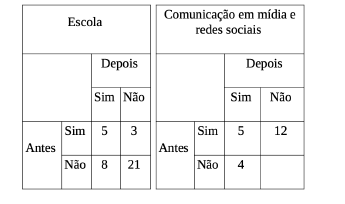
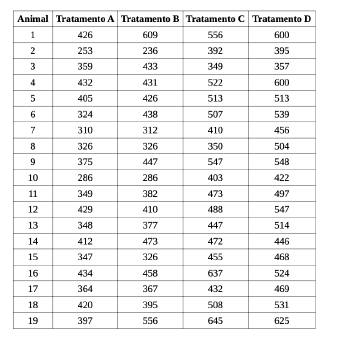

```{r setup, include=FALSE}
knitr::opts_chunk$set(echo = TRUE, warning = FALSE)
```

```{r libraries, echo=FALSE, warning = FALSE, message=FALSE}

library(readxl)
library(dplyr)
library(tidyr)
library(lubridate)
library(car)
library(tidyverse)
library(reshape2)
library(ggplot2)
library(rpart)       
library(rpart.plot)  
library(caret)  
library(PMCMRplus)
```

#  Exercício 1

No artigo 
**Eficácia de ação educativa com reeducandas de cadeia pública de Mato Grosso sobre o vírus HPV** 
(Corsino, P. K. D. *et al.*, Saúde e Pesquisa, 2018) os autores analisaram o impacto de ações educativas, sobre o vírus HPV, em reeducandas de Cadeia Pública Feminina de Mato Grosso. Entre outras variáveis, eles registraram idade, estado civil, grau de escolaridade, quantidade de filhos, motivo de estarem detidas e tempo de detenção, para cada uma das detentas participantes do estudo. 

- Item a: Classifique, usando os tipo de variáveis e escala de medidas, as variáveis como se você fosse o pesquisador (como se a pesquisa fosse **sua** e como achar importante registrar os valores). Justifique **suas** escolhas de registro. 

## Solução 1.a:

A classificação correta das variáveis é fundamental para a escolha dos testes estatísticos apropriados na análise de dados. Variáveis quantitativas permitem cálculos de média e dispersão, enquanto variáveis qualitativas exigem análise de frequência e testes de associação. Além disso, entender a escala de medida ajuda a evitar interpretações erradas e escolher os métodos estatísticos mais adequados. Lembremos que as variáveis podem ser classificadas em dois grandes grupos:

- **Qualitativas:** Representam categorias e podem ser **nominais**, isso é sem ordem natural, ou podem ser **ordinais**, isto é com uma ordem definida.

- **Quantitativas:** Representam números e podem ser **discretas**, valores inteiros, ou podem ser **contínuas**, isso é com valores em números reais.

Além disso, as escalas de medida são:

- **Nominal:** Categorização sem ordem.

- **Ordinal:** Categorização com ordem definida.

- **Intervalar:** Diferenças entre valores fazem sentido, mas não há um zero absoluto.

- **Razão:** Diferenças e razões fazem sentido, e há um zero absoluto.

Abaixo, classificamos as variáveis do estudo conforme seu tipo e escala de medida:

| Variável                | Tipo da Variável | Escala de Medida  | Justificativa                          |
|-------------------------|-----------------|-------------------|-----------------------------------------|
| **Idade**               | Quantitativa Contínua | Razão | A idade é uma variável quantitativa porque pode ser expressa numericamente e comparada entre indivíduos. Ela é contínua porque pode assumir qualquer valor dentro de um intervalo, uma pessoa pode ter 25.5 anos. A escala de medida é de razão, pois possui um zero absoluto onde 0 anos significa ausência de idade.  A razão entre valores faz sentido, por exemplo, uma pessoa de 30 anos tem o dobro da idade de uma pessoa de 15 anos. |
| **Estado civil**        | Qualitativa Nominal  | Nominal | O estado civil é uma variável qualitativa porque representa categorias sem um valor numérico associado. Ela é nominal, pois as categorias solteira, casada, divorciada, viúva, etc, não possuem uma ordem hierárquica natural. Não faz sentido dizer que "casada" é maior que "solteira", apenas que são estados diferentes. |
| **Grau de escolaridade**| Qualitativa Ordinal  | Ordinal | O grau de escolaridade é uma variável qualitativa, pois representa níveis educacionais em categorias. Porém, ela é ordinal, pois há uma relação de ordem entre os níveis fundamental < médio < superior. Apesar de ter hierarquia, a diferença entre os níveis não é mensurável de forma numérica precisa pois não faz sentido dizer que ensino médio é “duas vezes maior” que ensino fundamental. |
| **Quantidade de filhos**| Quantitativa Discreta | Razão | A quantidade de filhos é uma variável quantitativa discreta, pois assume apenas valores inteiros, não faz sentido dizer que uma pessoa tem 2.5 filhos. A escala é de razão, pois há um zero absoluto, onde 0 filhos significa ausência de filhos e comparações multiplicativas fazem sentido, por exemplo, uma pessoa com 4 filhos tem o dobro de filhos que uma pessoa com 2. |
| **Motivo da detenção**  | Qualitativa Nominal  | Nominal | O motivo da detenção é uma variável qualitativa nominal, pois representa categorias distintas, por exemplo tráfico de drogas, roubo, homicídio, não possuem ordem natural entre elas. Não há hierarquia entre os diferentes motivos de detenção, portanto, a escala de medida é nominal. |
| **Tempo de detenção**   | Quantitativa Contínua | Razão | O tempo de detenção é uma variável quantitativa contínua, pois pode ser expresso em frações de tempo seja em anos, meses ou dias. Ele segue a escala de razão, pois há um zero absoluto, 0 anos de detenção significa ausência de detenção e a relação entre valores é significativa por exemplo, 4 anos de detenção é o dobro de 2 anos. |

Note que Tempo de detenção pode ser interpretado como quantitativo contínuo ou discreto, dependendo da forma como os dados foram coletados. Se for em anos inteiros, pode ser discreto; se for em dias ou meses e permitir frações, contínuo.


- Item b. Para verificar o efeito da ação educativa sobre o vírus HPV, as detentas responderam um questionário antes e após as ações educativas (filmes, palestras, *etc.*). Neste estudo, a respeito dos locais/meios onde as detentas adquiraram conhecimento sobre HPV antes/após a ação educativa, considere duas situações Escola e, Comunicação em mídia e redes socias). Escolha entre uma entre as duas formas: 
**Escola** ou **Comunicação em mídia e redes sociais**. A realização da ação educativa contribuiu significativamente com a informação dessas mulheres sobre o HPV? Descreva as suposiçoes, hipóteses, aplique o teste de hipóteses adequado e apresente uma conclusão.

{width=35%}

## Solução 1.b:

Para resolver essa questão usaremos o **Teste de McNemar**. O Teste de McNemar é utilizado para comparar proporções em amostras pareadas antes e depois de uma intervenção, como no caso da ação educativa sobre o HPV. Se tivéssemos dois grupos independentes, ou seja, detentas diferentes antes e depois, usaríamos um **Teste Qui-Quadrado** ao invés do McNemar. Mas como estamos comparando as mesmas detentas, o Teste de McNemar é o correto. Note que amostras são pareadas quando cada observação antes e depois pertence ao mesmo indivíduo e cada resposta posterior está diretamente relacionada à resposta inicial do mesmo participante. No caso do estudo sobre HPV temos  que as mesmas detentas responderam o questionário duas vezes, antes e depois da ação educativa. Os dados estão organizados como uma tabela de contingência 2x2, comparando as respostas antes e depois para cada detenta Cada detenta serve como seu próprio controle, ou seja, estamos analisando mudanças individuais. Portanto, as amostras são pareadas porque estamos observando a mesma população em dois momentos distintos.

1. Suposições do Teste de McNemar:

- As respostas antes e depois da intervenção são pareadas (as mesmas pessoas responderam o questionário antes e depois).
- A variável de interesse é dicotômica (Sim/Não).
- O teste avalia se houve mudança significativa no conhecimento sobre o HPV após a intervenção.

2. Hipóteses:
- Hipótese Nula ($H_0$): A ação educativa não teve impacto significativo, ou seja, as proporções de respostas "Sim" antes e depois são iguais.
- Hipótese Alternativa ($H_1$): A ação educativa teve impacto significativo, ou seja, as proporções de respostas "Sim" antes e depois são diferentes.

3. A seguir, aplicaremos o teste:

```{r}
# Criar a matriz de contingência para o teste de McNemar
dados <- matrix(c(5, 12, 4, 0), nrow = 2, byrow = TRUE,
                dimnames = list("Antes" = c("Sim", "Nao"),
                                "Depois" = c("Sim", "Nao")))

# Aplicar o teste de McNemar
teste <- mcnemar.test(dados, correct = TRUE)

# Exibir resultado do teste
print(teste)

```

Como o p-value é igual a 0.08012 é maior que 0.05, mas próximo de 0.05, podemos dizer que há uma tendência de mudança, mas a evidência estatística não é forte o suficiente para afirmar que a ação educativa teve um impacto significativo. Se tivéssemos um p-value menor que 0.05, concluiríamos que a ação educativa foi estatisticamente significativa. Portanto, concluímos que *NÃO* temos evidências estatísticas suficientes para afirmar que a ação educativa teve um impacto significativo sobre o conhecimento das detentas sobre HPV.

Vamos aumentar a sensibilidade do teste uando o Teste de McNemar sem a correção de continuidade, isso é mcnemar.test(dados, correct = FALSE), para ver se o p-value diminui pois não há como aumentarmos a amostra de dados para ter uma análise mais acertiva.

```{r}
# Aplicar o teste de McNemar
teste_2 <- mcnemar.test(dados, correct = FALSE)

# Exibir resultado do teste
print(teste_2)
```
```{r}
#if(!require(DescTools)) install.packages("DescTools", dependencies = TRUE)
library(DescTools)

# Calcular Odds Ratio e Intervalo de Confiança
OR_result <- OddsRatio(dados, conf.level = 0.95)

# Exibir resultado
print(OR_result)
```

4. Conclusão:

O Teste de McNemar sem correção mostrou um p-value igual a 0.0455 que é menor que 0.05, indicando que a diferença antes e depois da ação educativa não foi aleatória. Logo rejeitamos $H_0$ ao nível de 5% de significância, ou seja, agora temos evidências estatísticas para aceitar a hipótese alternativa $H_1$ que a ação educativa teve impacto significativo, ou seja, as proporções de respostas "Sim" antes e depois são diferentes. Isso não significa que  $H_1$ é uma verdade absoluta,  significa apenas que há fortes evidências estatísticas para sustentá-la. Além disso, o OddsRatio igual a  0.0489, o que indica que a chance de mudança para "Sim" depois da intervenção é muito baixa em comparação com a chance de permanecer "Não".

# Exercício 2

Suponha que 100 pacientes, selecionados aleatoriamente (sob certas condições) sejam avaliados, quanto à dor. Dos que ingeriram placebo, 35 dos pacientes relataram algum alívio, mas os 65 restantes não. Sob um novo medicamento, 55 dos pacientes relataram algum alívio, enquanto 45 não. Das 65 pessoas que não relataram alívio sob o placebo, 30 também não relataram alívio sob o novo medicamento. Podemos dizer que existe evidência, nesta amostra, de que placebo e o novo medicamento tem efeitos diferentes? Descreva as suposiçoes hipóteses, aplique o teste de hipótese adequado e apresente uma conclusão.

## Solução 2:

O Teste de McNemar é a melhor opção para analisar mudanças nas respostas dos mesmos indivíduos antes e depois da administração do novo medicamento porque as amostras são pareadas, isso é, os mesmos pacientes foram analisados antes e depois. Além disso a  variável é categórica dicotômica e o nosso objetivo é testar diferenças entre placebo e medicamento nos mesmos indivíduos. Se tivéssemos grupos independentes, usaríamos o Teste Qui-Quadrado.

1. Suposições:
Para aplicar corretamente o Teste de McNemar, precisamos garantir que as seguintes suposições sejam atendidas:

-  Dados Pareados: O mesmo grupo de 100 pacientes foi avaliado antes e depois, placebo e novo medicamento. Isso significa que cada paciente serve como seu próprio controle, ou seja, temos amostras dependentes.
- Variáveis Categóricas Dicotômicas: Cada paciente respondeu se sentiu alívio da dor ou não → Variável binária (Sim/Não).
- Tamanho Amostral Suficiente: O Teste de McNemar funciona melhor para amostras grandes. Nossa amostra tem 100 pacientes, o que geralmente é suficiente para esse teste.

Como essas suposições foram atendidas, podemos prosseguir com o Teste de McNemar.

2. Hipóteses:

- Hipótese Nula $H_0$: Não há diferença significativa entre os efeitos do placebo e do novo medicamento.
- Hipótese Alternativa $H_1$: Há uma diferença significativa entre os efeitos do placebo e do novo medicamento.

3. Tabela de Contigência:

```{r}
# Criar a matriz de contingência para o Teste de McNemar
dados <- matrix(c(35, 30, 25, 10), nrow = 2, byrow = TRUE,
                dimnames = list("Placebo" = c("Alívio", "Sem Alívio"),
                                "Novo Medicamento" = c("Alívio", "Sem Alívio")))

# Exibir a tabela formatada
print(dados)

```

4. Aplicar o Teste de McNemar

```{r}
# Aplicar o Teste de McNemar
teste <- mcnemar.test(dados, correct = FALSE)

# Exibir resultado
print(teste)

```
```{r}
OR_result <- OddsRatio(dados, conf.level = 0.95)

# Exibir resultado
print(OR_result)
```
5. Conclusão:

Com base nesta amostra, não rejeitamos a hipótese nula e não há evidências estatísticas de que o novo medicamento seja mais eficaz que o placebo. Pois o p-value alto de  0.5002 indica que a diferença observada nos dados pode ter ocorrido por acaso,  sugerindo que o efeito do novo medicamento pode ser semelhante ao do placebo, pelo menos na amostra estudada. O OddiosRatio igual a  0.4667, o que indica que o novo medicamento tem menos chances de produzir alívio do que o placebo. Como o intervalo inclui o valor 1, o resultado não é estatisticamente significativo, reforçando que não há evidencia suficiente de que o novo medicamento seja melhor que o placebo.

# Exercício 3

Agar-agar, um gel preparado a partir das paredes celulares de várias algas vermelhas, é usado como meio de cultura em laboratórios e também como espessante, estabilizante ou adesivo nas indústrias de alimentos,cosméticos e fármacos. Geyer *et al.* (1990) estudaram como o teor de agar-agar extraído da alga *Pterocladia capillacea (Rhodophyceae)* variava com a localidade onde as amostras eram colhidas, na costa próxima à Arraial do Cabo (RJ). Os resultados foram:

Local A: (39.75, 36.40, 33.88, 27.85, 31.42, 34.40, 36.62, 36.50, 38.40, 23.80)

Local B: (42.37, 45.23, 34.14, 37.00, 29.96, 31.82, 34.58, 42.58, 42.38)

Existe diferença entre os teores de agar-agar, considerando as duas localidades? Descreva as suposições, hipóteses, aplique o teste de hipótese adequado e apresente uma conclusão.

## Solução:
Para resolver essa questão, precisamos determinar se há diferença significativa entre os teores de agar-agar extraídos em dois locais diferentes. Como os dados são quantitativos e contínuos, e estamos comparando duas amostras independentes, podemos utilizar um teste não paramétrico.

1. Suposições:

Antes de escolher o teste estatístico adequado, precisamos garantir que algumas suposições sejam avaliadas.

- Variáveis quantitativas: Os teores de agar-agar são medidas contínuas, em números reais. Logo, os dados atendem a essa condição.
-  Amostras independentes: Cada local tem um conjunto diferente de amostras, coletadas separadamente.Logo, as amostras de Local A e Local B são independentes.
- Normalidade dos dados: usaremos o teste de Kolmogorov-Smirnov para verificar se os dados seguem uma distribuição normal. Assim, temos as seguintes hipóteses:

$H_0$ Os dados seguem uma distribuição normal.
$H_1$ Os dados não seguem uma distribuição normal.

```{r}
# Criar os vetores com os teores de agar-agar
local_A <- c(39.75, 36.40, 33.88, 27.85, 31.42, 34.40, 36.62, 36.50, 38.40, 23.80)
local_B <- c(42.37, 45.23, 34.14, 37.00, 29.96, 31.82, 34.58, 42.58, 42.38)

# Visualizar um resumo dos dados
summary(local_A)
summary(local_B)

```
```{r}
# Teste de Kolmogorov-Smirnov para normalidade
ks.test(local_A, "pnorm", mean(local_A), sd(local_A))
ks.test(local_B, "pnorm", mean(local_B), sd(local_B))


```

Como ambos os p-values são maiores que 0.05, não rejeitamos $H_0$. Ou seja,  isso indica que os dados podem ser tratados como normais com base no Teste de Kolmogorov-Smirnov.

2. Hipóteses:

Nosso objetivo é testar se há diferença nos teores de agar-agar entre os dois locais.

- Hipótese Nula $H_0$: Os teores de agar-agar nos dois locais são iguais, as medianas são iguais.
- Hipótese Alternativa $H_1$: Os teores de agar-agar são diferentes entre os locais, as medianas são diferentes.

3. Escolha do teste estatístico:

Utilizaremos o teste de Teste de Mann-Whitney para a  Comparação de duas amostras independentes. Pois mesmo que os dados sejam normais, pode ser utilizado para comparação de medianas.

```{r}
wilcox_test <- wilcox.test(local_A, local_B, alternative = "two.sided", conf.int = TRUE)
print(wilcox_test)

```
4. Conclusão:
Como, p é maior que 0.05, nós não rejeitamos a hipótese nula $H_0$, logo não há evidências estatísticas suficientes para afirmar que os teores médios de agar-agar nos locais A e B são diferentes. Isso significa que  a variação observada nas médias pode ser resultado do acaso, e não de um efeito real das diferenças entre as localidades. O intervalo de confiança contém 0, reforçando a ideia de que não há evidência suficiente para afirmar que os locais têm teores diferentes.

# Exercício 4 

Para avaliar o efeito de anestésicos, um estudo foi realizado aplicando quatro diferentes tipos de anestésico em determinada espécie de animal. Neste estudo, 19 animais, desta espécie, receberam inicialmente o medicamento pentobarbital. Cada animal recebeu dióxido de carbono (CO2) em cada um dos dois níveis de pressão (alta e baixa). Em seguida, halotano (H) foi adicionado e a administração de CO2 foi repetida. Os batimentos cardíacos (em milissegundos) foram registrados para as quatro combinações de tratamento:

Tratamento A: Alta pressão de CO2 sem halotano

Tratamento B: Baixa pressão de CO2 sem halotano

Tratamento C: Alta pressão de CO2 com halotano

Tratamento D: Baixa pressão de CO2 com halotano

Os resultados foram:

{width=40%}

(como descrito em Johnson, R. A.; Wichern, D. W. "Applied multivariate statistical analysis", 2002).

- Item a Apresente uma análise descritiva (tipos e variáveis envolvidas, gráficos e medidas resumo).

## Solução 4.a:

1. Primeiramente vamos identificar as variáveis envolvidas e seus tipos. 
 
1.1. Variável Dependente (Resposta): 

- **Batimentos cardíacos**, que é do tipo  **quantitativa Contínua** pois é medida em milissegundos.

1.2. Variáveis Independentes:

- **Pressão de $CO_2$** (Alta/Baixa), que é do tipo **qualitativa Nominal**.
- **Presença de Halotano** (Com/Sem), que é do tipo **qualitativa Nominal**.
- **Tratamento (A, B, C, D)**, que é do tipo **qualitativa Nominal**. Onde as combinações de tratamento são:

|Tratamento |	Pressão de $CO_2$	| Halotano     |
|-----------|-------------------|--------------|
| A	        | Alta	            | Sem Halotano |
| B	        | Baixa          	  | Sem Halotano |
| C	        | Alta 	            | Com Halotano |
| D	        | Baixa     	      | Com Halotano |

2. Análise Descritiva.
O código a baixo nos traz um resumo das principais medidas descritivas, média, mediana, desvio padrão, minímo e máximo além dos quartis.
```{r}
# Criar o dataframe com os dados
dados_2 <- data.frame(
  Tratamento_A = c(426, 253, 359, 393, 405, 412, 376, 319, 438, 412, 348, 329, 
                   376, 405, 312, 326, 375, 394, 387),
  Tratamento_B = c(609, 426, 433, 482, 426, 486, 500, 400, 493, 473, 377, 347, 
                   395, 508, 376, 359, 508, 506, 556),
  Tratamento_C = c(556, 392, 349, 349, 513, 513, 410, 392, 347, 427, 477, 420, 
                   486, 470, 437, 405, 438, 425, 545),
  Tratamento_D = c(600, 395, 357, 357, 513, 513, 395, 362, 375, 416, 514, 478, 
                   496, 452, 396, 432, 469, 446, 625)
)

# Estatísticas descritivas para cada tratamento
resumo <- summary(dados_2)
print(resumo)
# Desvio Padrão para cada tratamento
desvio <- apply(dados, 2, sd)
print(desvio)
```

Através dos resumos acima temos que o Tratamento B apresentou a maior média e mediana, indicando que baixar a pressão de $CO_2$ sem Halotano pode aumentar os batimentos cardíacos. O Tratamento A apresentou os valores mais baixos de média e mediana, sugerindo que manter uma alta pressão de $CO_2$ sem Halotano pode reduzir os batimentos cardíacos. O Tratamento D apresentou alta média e alta variabilidade, sugerindo que o efeito de baixa pressão de $CO_2$  combinada com Halotano pode ser mais instável entre os animais. O Tratamento C foi intermediário, mais próximo de D, indicando que a combinação de alta pressão de $CO_2$ com Halotano também pode aumentar os batimentos, mas com menor intensidade que D.

3. Visualização:

```{r}
# Criar boxplot para comparar os tratamentos
boxplot(dados_2, main="Distribuição dos Batimentos Cardíacos por Tratamento",
        col=c("lightblue", "lightgreen", "pink", "yellow"),
        xlab="Tratamentos", ylab="Batimentos Cardíacos (ms)")

```

Os Boxplot acima nos mostra que os tratamentos B e D parecem elevar os batimentos cardíacos significativamente. O Tratamento A pode ter um efeito de redução nos batimentos cardíacos. Enquanto o Tratamento C tem um efeito intermediário e menos variável.

- Item b Sob a abordagem não paramétrica, é possível afirmar, nesta amostra, que os diferentes tipos de anestésicos sao semelhantes? Se sim, quais pares apresentam resultados diferentes? Descreva as suposições, hipóteses, aplique o teste de hipótese adequado e apresente uma conclusão.

## Solução 4.b:
1. Escolha do Teste Não Parâmetrico:

Como temos quatro grupos de tratamentos e cada animal foi submetido a todos os quatro tratamentos, temos que os dados são pareados. Neste caso, o Teste de Friedman é mais apropriado.

2. Suposições:

- As amostras são independentes: Sim, pois cada tratamento foi aplicado separadamente.
- A variável de resposta (batimentos cardíacos) quantitativa contínua: Sim, pois os batimentos cardiacos é uma variável quantitativa contínua.
- As distribuições dos tratamentos podem ser comparadas em termos de ranking (postos).

3. Hipóteses: 

- Hipótese Nula $H_0$: Os batimentos cardíacos são estatisticamente semelhantes entre os quatro tratamentos (A, B, C e D).
- Hipótese Alternativa $H_1$: Pelo menos um dos tratamentos tem um efeito significativamente diferente nos batimentos cardíacos.

4. Aplicação do teste:

```{r}

dados_friedman <- data.frame(
  Tratamento_A = c(426, 253, 359, 393, 405, 412, 376, 319, 438, 412, 348, 329, 376, 405, 312, 326, 375, 394, 387),
  Tratamento_B = c(609, 426, 433, 482, 426, 486, 500, 400, 493, 473, 377, 347, 395, 508, 376, 359, 508, 506, 556),
  Tratamento_C = c(556, 392, 349, 349, 513, 513, 410, 392, 347, 427, 477, 420, 486, 470, 437, 405, 438, 425, 545),
  Tratamento_D = c(600, 395, 357, 357, 513, 513, 395, 362, 375, 416, 514, 478, 496, 452, 396, 432, 469, 446, 625)
)

# Aplicar o Teste de Friedman
friedman_test <- friedman.test(as.matrix(dados_friedman))

# Exibir resultado
print(friedman_test)

```
5. COnclusão do Teste:

Como o p valor é muito menor que 0.05 rejeitamos a hipótese nula $H_0$. Ou seja, pelo menos um dos tratamentos causou um efeito significativamente diferente nos batimentos cardíacos. Para descobrir quais pares de tratamentos apresentam diferenças, precisamos aplicar um  Teste de Conover-Nemenyi.

6. Teste de Conover-Nemenyi:

```{r}
# Instalar e carregar pacotes necessários
if(!require(PMCMRplus)) install.packages("PMCMRplus", dependencies = TRUE)
library(PMCMRplus)

# Reformular os dados para formato longo (long format)
dados_long <- data.frame(
  Animal = rep(1:19, times = 4),  # Criamos um identificador único para cada animal
  Tratamento = factor(rep(c("A", "B", "C", "D"), each = 19)),  
  Batimentos = c(
    426, 253, 359, 393, 405, 412, 376, 319, 438, 412, 348, 329, 376, 405, 312, 326, 375, 394, 387,
    609, 426, 433, 482, 426, 486, 500, 400, 493, 473, 377, 347, 395, 508, 376, 359, 508, 506, 556,
    556, 392, 349, 349, 513, 513, 410, 392, 347, 427, 477, 420, 486, 470, 437, 405, 438, 425, 545,
    600, 395, 357, 357, 513, 513, 395, 362, 375, 416, 514, 478, 496, 452, 396, 432, 469, 446, 625
  )
)

# Converter os dados para formato de matriz antes de aplicar o teste
dados_matriz <- reshape(dados_long, idvar = "Animal", timevar = "Tratamento", direction = "wide")

# Remover a coluna de identificador Animal para que apenas os valores numéricos sejam usados
dados_matriz <- as.matrix(dados_matriz[,-1]) 

# Aplicar o Teste de Comparações Múltiplas Pós-Hoc de Conover-Nemenyi
posthoc_result <- frdAllPairsConoverTest(dados_matriz, p.adjust.method = "bonferroni")

# Exibir os resultados
print(posthoc_result)


```

7. Conclusão Final:

Os resultados do Conover-Nemenyi nos diz  que o Tratamento A tem um efeito significativamente diferente de todos os outros tratamentos (B, C e D). Os tratamentos B, C e D não diferem estatisticamente entre si.  Isso sugere que a condição representada pelo Tratamento A teve um efeito estatisticamente diferente dos demais, enquanto os outros tratamentos (B, C, D) tiveram efeitos semelhantes entre si.

Portanto, o Teste de Conover-Nemenyi confirmou que o Tratamento A é o único estatisticamente diferente dos outros, validando a hipótese alternativa $H_1$.
