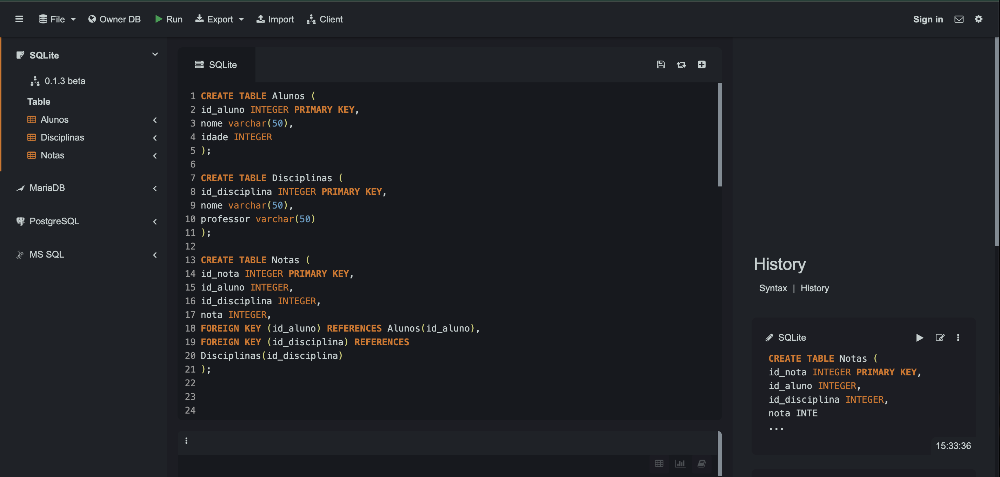
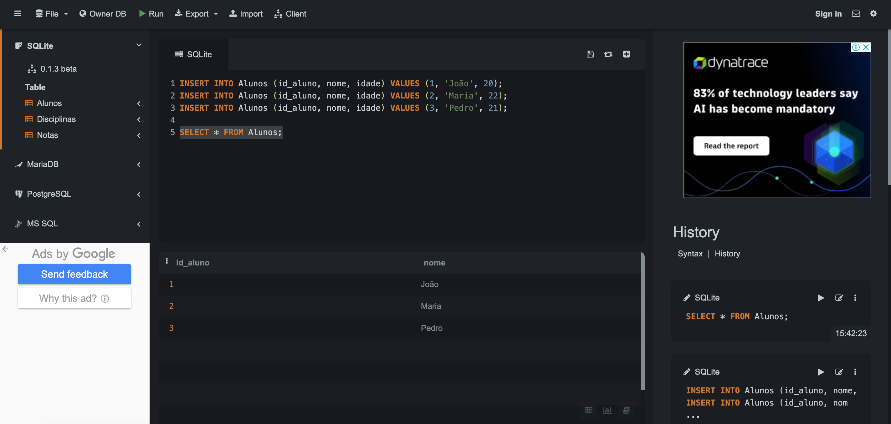
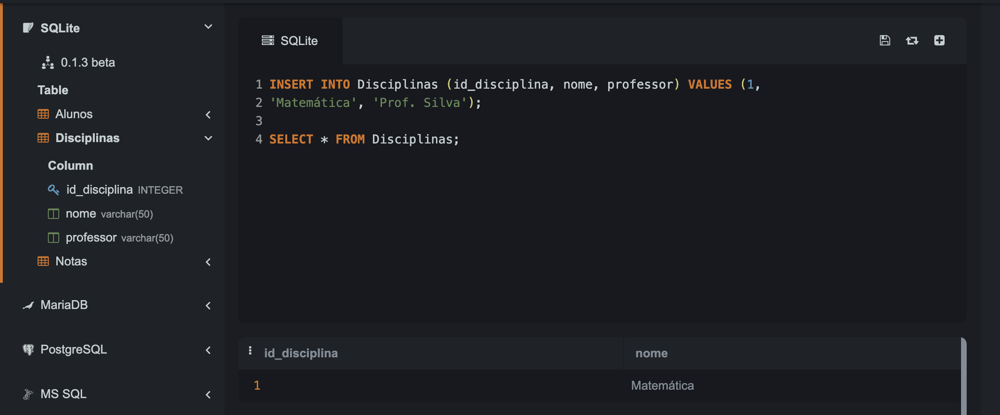
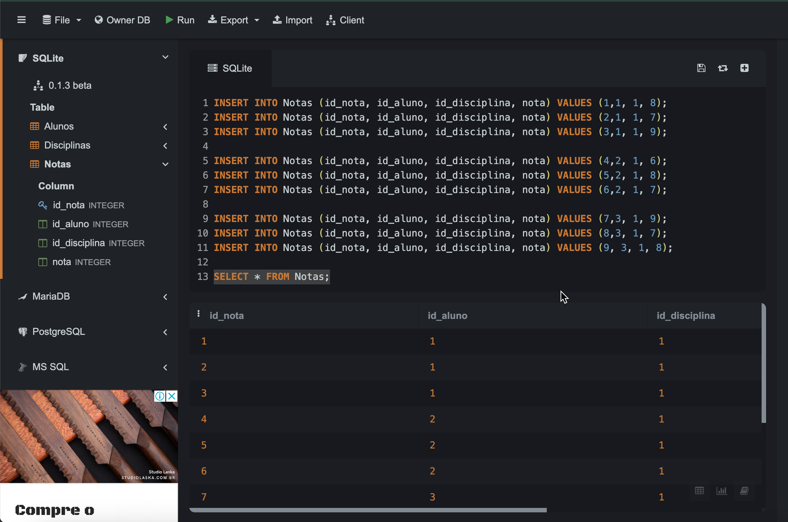
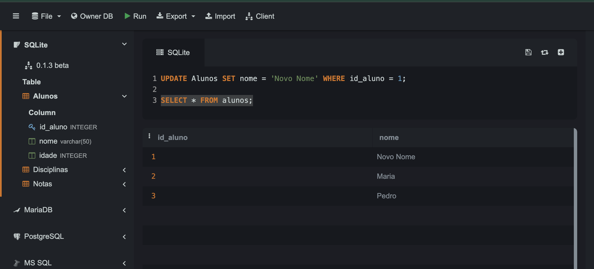
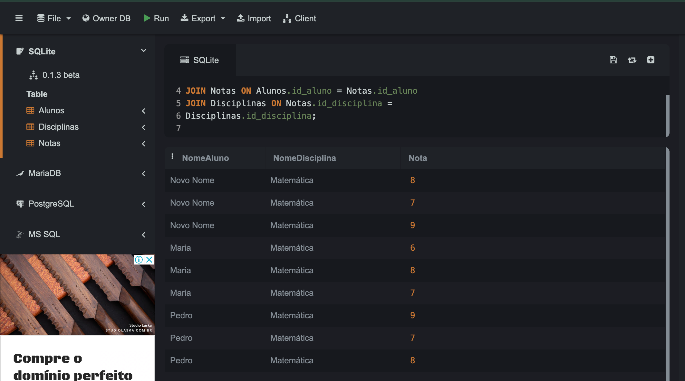
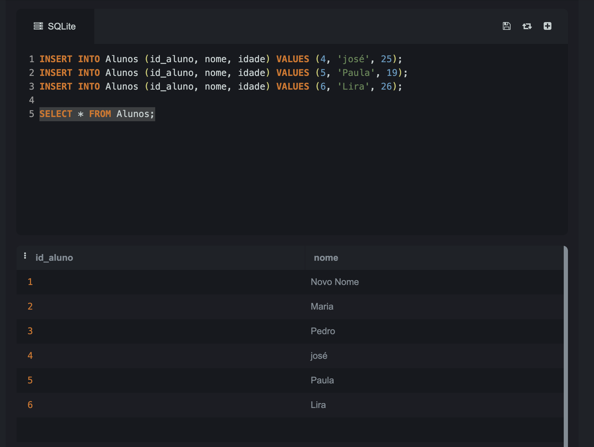
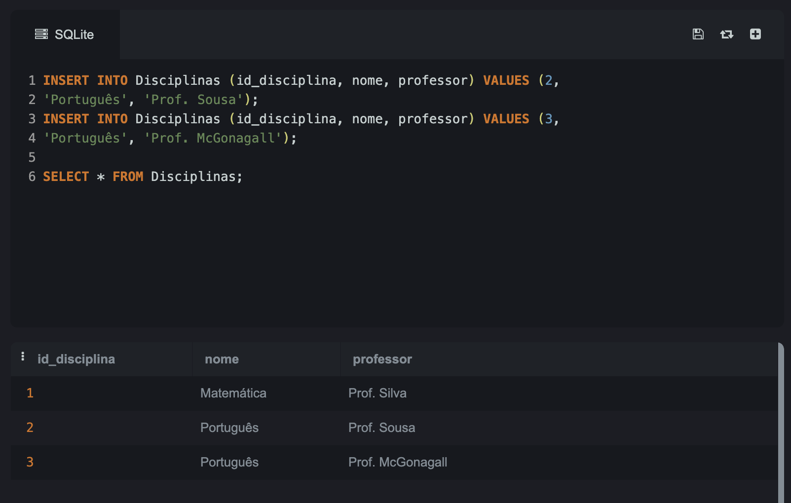
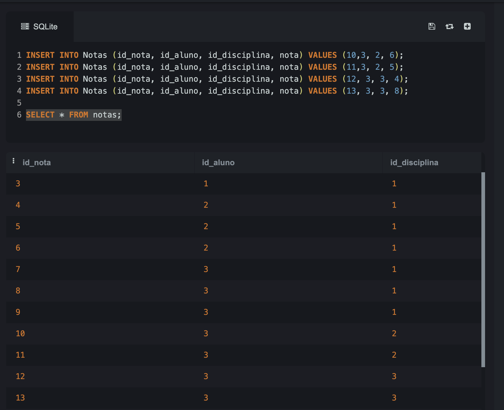
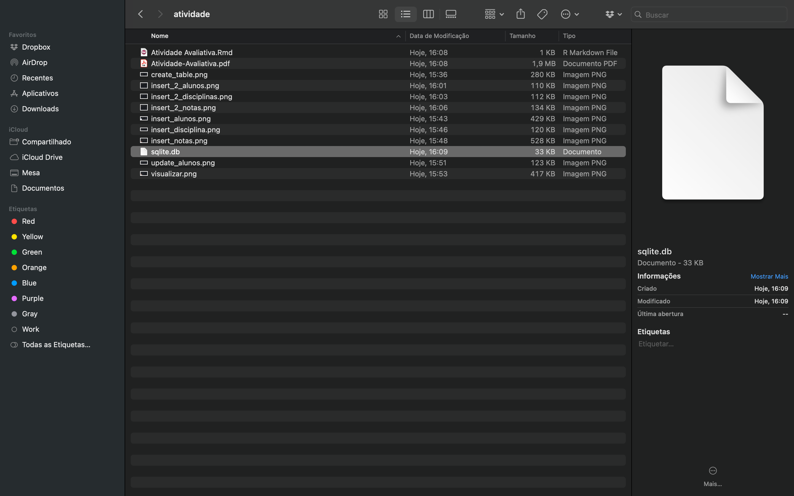

```{=html}
<style>body {text-align: justify}</style>
```
```{r setup, include=FALSE}
knitr::opts_chunk$set(echo = TRUE)
```

*Questão 1. Na ferramenta SQLite IDE, crie e execute os scripts do BD disponíveis em [google drive](https://docs.google.com/document/d/1_ebLMDXezQl8xBTJn7a9LKbeIsNTbvIEYxSeqMuZbhc/edit?usp=drive_link).*

### Solução:

- Passo 1: Criar as tabelas.



- Passo 2: Inserir dados na tabela Alunos.



- Passo 3: Inserir dados na tabela Disciplina.




- Passo 4: Inserir dados na tabela Notas.



- Passo 5: Update de dados na tabela Alunos.



- Passo 6: Visualizando as tabelas interligadas.




*Questão 2. Na ferramenta SQLite IDE, insira linhas em todas as tabelas do BD criado.*

### Solução:
- Passo 1: Insert na tabela Alunos.



- Passo 2: Insert na tabela Disciplinas.



- Passo 3: Insert na tabela Notas.



- Passo 3: Insert na tabela Alunos.


*Questão 3. Na ferramenta SQLite, gere o BD na forma de um arquivo e armazene-o em uma pasta/diretório no seu computador.*

### Solução:



*Questão 4. No R, faça a conexão com o BD usando o arquivo gerado no enunciado 3.*

### Solução

```{r}
library("RSQLite")
setwd("/Users/anamaria/especializacao/modulo_2/atividade/")
conexao <- RSQLite::dbConnect(RSQLite::SQLite(), dbname = "sqlite.db")
```


```{r}
DBI::dbListTables(conexao)
```

*Questão 5. No R, construa três consultas SQL selecionando diretamente do BD linhas das tabelas utilizando a cláusula WHERE.*

### Solução

```{sql}
--| connection = conexao
-- Consulta na tabela Alunos
SELECT * FROM Alunos where nome ='Paula';
```

```{sql}
--| connection = conexao
-- Consulta na tabela Disciplina
SELECT * FROM Disciplinas where nome ='Português';
```


```{sql}
--| connection = conexao
-- Consulta na tabela Disciplina
SELECT * FROM Notas where nota > 8;
```

*Questão 6. No R, faça a importação das tabelas para data frames.*

### Solução

- Dataframe Alunos:
```{r}
library("dplyr")
library("tibble") # Carregar a biblioteca
alunos_tbl <- dplyr::tbl(conexao,"Alunos")
alunos_df <- dplyr::collect(alunos_tbl)
```

```{r}
alunos_df
```

- Dataframe Disciplinas:
```{r}
disciplinas_tbl <- dplyr::tbl(conexao,"Disciplinas")
disciplinas_df <- dplyr::collect(disciplinas_tbl)
```

```{r}
disciplinas_df
```

- Dataframe Notas:
```{r}
notas_tbl <- dplyr::tbl(conexao,"Notas")
notas_df <- dplyr::collect(notas_tbl)
notas_df
```

*Questõ 7. No R, faça consultas utilizando select() do pacote dplyr nos objetos tibble correspondentes aos data frames gerados no enunciado 6.*

### Solução
```{r}
alunos1 <- dplyr::sql("SELECT * FROM Alunos WHERE idade > 22")
alunos_select <- dplyr::tbl(conexao, alunos1)
alunos_db_select <- dplyr::collect(alunos_select)
alunos_db_select
```

```{r}
disciplinas1 <- dplyr::sql("SELECT * FROM Disciplinas WHERE nome != 'Português'")
disciplinas_select <- dplyr::tbl(conexao, disciplinas1)
disciplinas_db_select <- dplyr::collect(disciplinas_select)
disciplinas_db_select
```

```{r}
notas1 <- dplyr::sql("SELECT * FROM Notas WHERE nota <= 6")
notas_select <- dplyr::tbl(conexao, notas1)
notas_db_select <- dplyr::collect(notas_select)
notas_db_select
```

*8.(opcional) Realize o mesmo processo (enunciados 2 até 7) para o BD "Animais de uma Fazenda", disponível em [google drive](https://drive.google.com/file/d/1manYTl1tuIXJYyc0jsub7sGmrS4AuGgD/view?usp=drive_link) (páginas 22 a 25, apostila de SQllite).*

### Solução

Para questão de otimização do relatório, irei omitir os prints da criação do BD. O BD estará anexado no arquivo compactado que está anexado.

- Conectando no BD

```{r}
conexao_animal <- RSQLite::dbConnect(RSQLite::SQLite(), dbname = "animal.db")
```

- Realizar consultas utilizando a cláusula *Where*

```{sql}
--| connection = conexao_animal
-- Consulta na tabela Animal
SELECT * FROM Animal where peso_desm <= 200;
```

```{sql}
--| connection = conexao_animal
-- Consulta na tabela Fazenda
SELECT * FROM Fazenda where id_faz = 1;
```

```{sql}
--| connection = conexao_animal
-- Consulta na tabela Vacina
SELECT * FROM  Vacina where data_venc <= '2024-02-01';
```

```{sql}
--| connection = conexao_animal
-- Consulta na tabela Vacinacao
SELECT * FROM  Vacinacao where data_vacinacao <= '2022-09-15';
```

- Importação das tabelas para dataframes.
```{r}
animal_tbl <- dplyr::tbl(conexao_animal,"Animal")
animal_df <- dplyr::collect(animal_tbl)
animal_df
```

```{r}
fazenda_tbl <- dplyr::tbl(conexao_animal,"Fazenda")
fazenda_df <- dplyr::collect(fazenda_tbl)
fazenda_df
```

```{r}
vacina_tbl <- dplyr::tbl(conexao_animal,"Vacina")
vacina_df <- dplyr::collect(vacina_tbl)
vacina_df
```

```{r}
vacinacao_tbl <- dplyr::tbl(conexao_animal,"Vacinacao")
vacinacao_df <- dplyr::collect(vacinacao_tbl)
vacinacao_df
```

- Faça consultas utilizando select() do pacote dplyr nos objetos tibble correspondentes aos data frames gerados no item anterior.

```{r}
animais1 <- dplyr::sql("SELECT * FROM Animal WHERE data_nasc <= '2022-03-01'")
animais_select <- dplyr::tbl(conexao_animal, animais1)
animais_db_select <- dplyr::collect(animais_select)
animais_db_select
```

```{r}
vacina1 <- dplyr::sql("SELECT * FROM vacina WHERE id_vacina <= 2")
vacina_select <- dplyr::tbl(conexao_animal, vacina1)
vacina_db_select <- dplyr::collect(vacina_select)
vacina_db_select
```

```{r}
vacinacao1 <- dplyr::sql("SELECT * FROM vacinacao WHERE nome_aplicador = 'Aplicador 1'")
vacinacao_select <- dplyr::tbl(conexao_animal, vacinacao1)
vacinacao_db_select <- dplyr::collect(vacinacao_select)
vacinacao_db_select
```

*Questão 9.(opcional) Realize o mesmo processo (enunciados 2 até 7) para o BD cujo modelo está disponível no slide 37 disponível em [google drive](https://drive.google.com/file/d/1DcMGlIaxX4qhcYUZtfwrpOM5A3tm4_mr/view?usp=drive_link)*

### Solução

A solução é igual a do item anterior, mudando apenas as tabelas do BD.

*Questão 10. Considere o BD descrito no [Link](https://docs.google.com/document/d/1aeXm28RG-LOCD8nKd9ivhtImiTymc5mU1a_PFHvs19Y/edit). Realize o mesmo processo (enunciados 2 até 7) para este BD. Além disso,  execute as dez operações propostas (que estão nos exercícios de integridade) e discuta as restrições de integridade violadas por cada operação (se houver alguma, dada uma operação ela viola alguma coisa?), e as diferentes maneiras de lidar com essas restrições.*