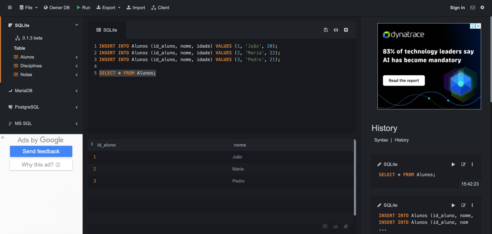
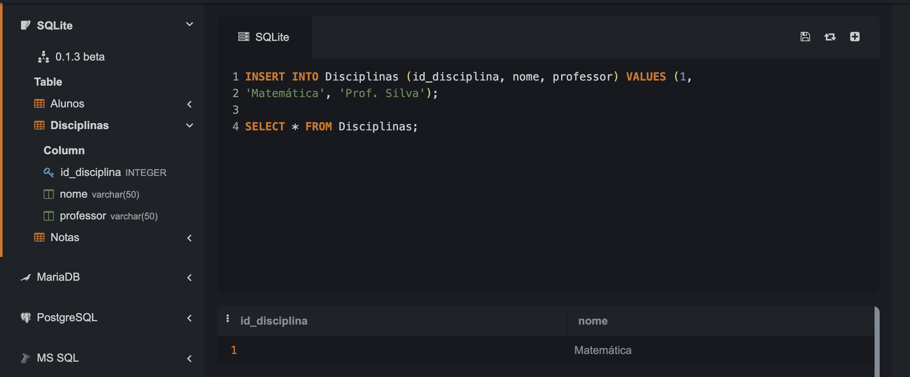
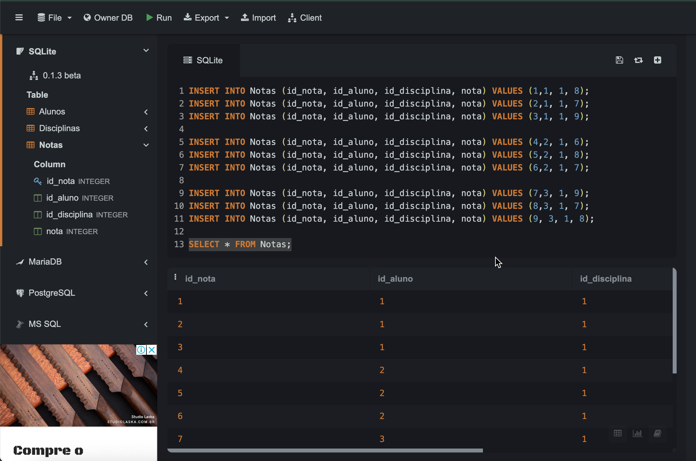
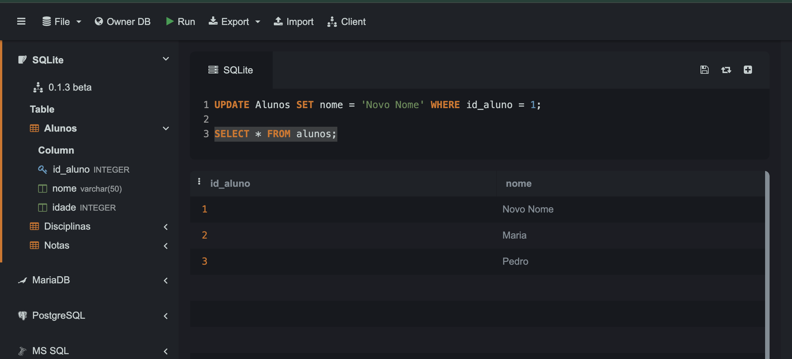
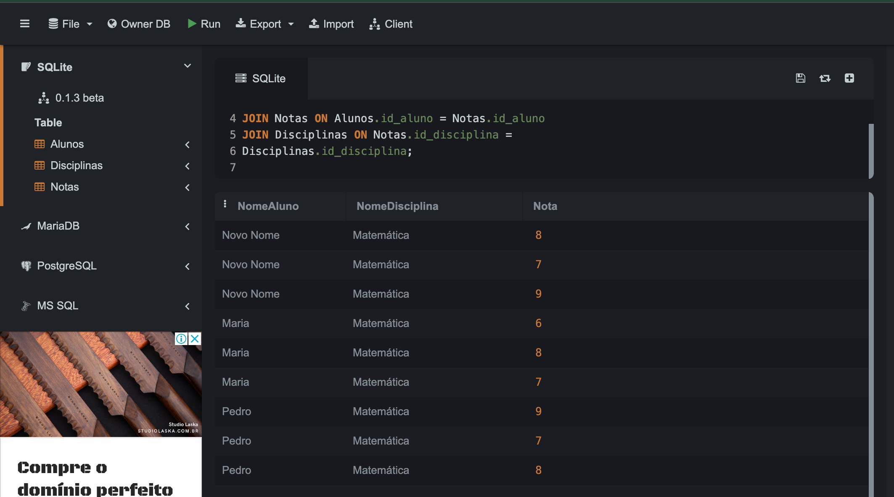
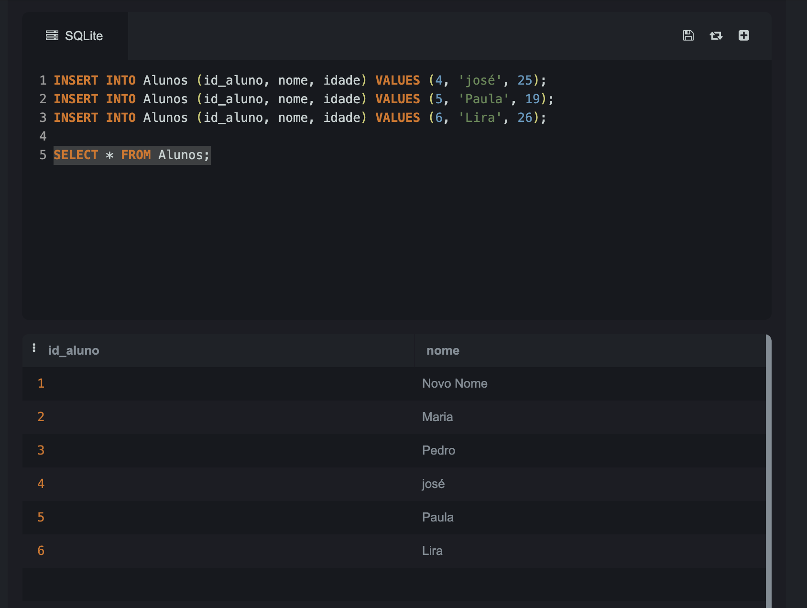
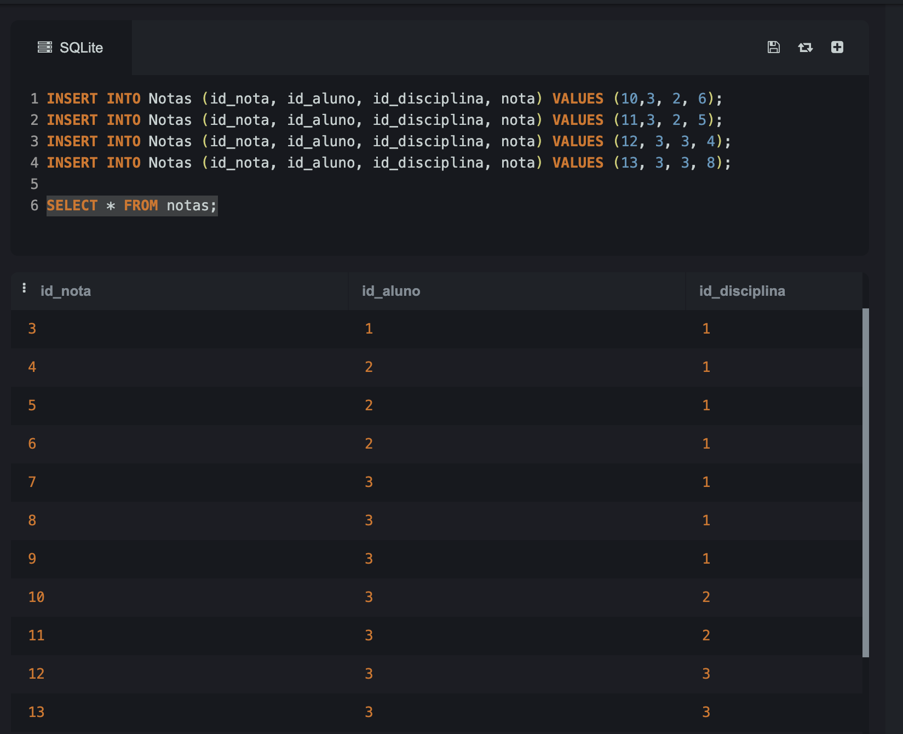
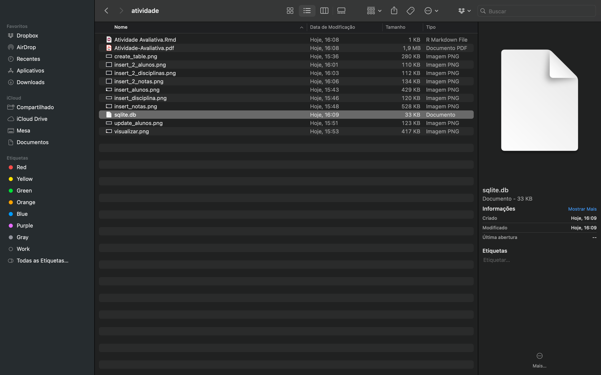

```{=html}
<style>body {text-align: justify}</style>
```
```{r setup, include=FALSE}
knitr::opts_chunk$set(echo = TRUE)
```

## Questão 1. Na ferramenta SQLite IDE, crie e execute os scripts do BD disponíveis em [google drive](https://docs.google.com/document/d/1_ebLMDXezQl8xBTJn7a9LKbeIsNTbvIEYxSeqMuZbhc/edit?usp=drive_link).

### Solução 1:

- Passo 1: Criar as tabelas.


- Passo 2: Inserir dados na tabela Alunos.



- Passo 3: Inserir dados na tabela Disciplina.



- Passo 4: Inserir dados na tabela Notas.



- Passo 5: Update de dados na tabela Alunos.



- Passo 6: Visualizando as tabelas interligadas.



## Questão 2. Na ferramenta SQLite IDE, insira linhas em todas as tabelas do BD criado.

### Solução 2:
- Passo 1: Insert na tabela Alunos.



- Passo 2: Insert na tabela Disciplinas.


- Passo 3: Insert na tabela Notas.




## Questão 3. Na ferramenta SQLite, gere o BD na forma de um arquivo e armazene-o em uma pasta/diretório no seu computador.

### Solução 3:



## Questão 4. No R, faça a conexão com o BD usando o arquivo gerado no enunciado 3.

### Solução 4:

```{r}
library("RSQLite")
setwd("/Users/anamaria/especializacao/modulo_2/atividade/")
conexao <- RSQLite::dbConnect(RSQLite::SQLite(), dbname = "sqlite.db")
```


```{r}
DBI::dbListTables(conexao)
```

## Questão 5. No R, construa três consultas SQL selecionando diretamente do BD linhas das tabelas utilizando a cláusula WHERE.

### Solução 5:

```{sql}
--| connection = conexao
-- Consulta na tabela Alunos
SELECT * FROM Alunos where nome ='Paula';
```

```{sql}
--| connection = conexao
-- Consulta na tabela Disciplina
SELECT * FROM Disciplinas where nome ='Português';
```


```{sql}
--| connection = conexao
-- Consulta na tabela Notas
SELECT * FROM Notas where nota > 8;
```

## Questão 6. No R, faça a importação das tabelas para data frames.

### Solução 6:

- Dataframe Alunos:
```{r}
library("dplyr")
library("tibble")
alunos_tbl <- dplyr::tbl(conexao,"Alunos")
alunos_df <- dplyr::collect(alunos_tbl)
```

```{r}
alunos_df
```

- Dataframe Disciplinas:
```{r}
disciplinas_tbl <- dplyr::tbl(conexao,"Disciplinas")
disciplinas_df <- dplyr::collect(disciplinas_tbl)
```

```{r}
disciplinas_df
```

- Dataframe Notas:
```{r}
notas_tbl <- dplyr::tbl(conexao,"Notas")
notas_df <- dplyr::collect(notas_tbl)
notas_df
```

## Questão 7. No R, faça consultas utilizando select() do pacote dplyr nos objetos tibble correspondentes aos data frames gerados no enunciado 6.

### Solução 7:
```{r}
alunos1 <- dplyr::sql("SELECT * FROM Alunos WHERE idade > 22")
alunos_select <- dplyr::tbl(conexao, alunos1)
alunos_db_select <- dplyr::collect(alunos_select)
alunos_db_select
```

```{r}
disciplinas1 <- dplyr::sql("SELECT * FROM Disciplinas WHERE nome != 'Português'")
disciplinas_select <- dplyr::tbl(conexao, disciplinas1)
disciplinas_db_select <- dplyr::collect(disciplinas_select)
disciplinas_db_select
```

```{r}
notas1 <- dplyr::sql("SELECT * FROM Notas WHERE nota <= 6")
notas_select <- dplyr::tbl(conexao, notas1)
notas_db_select <- dplyr::collect(notas_select)
notas_db_select
```

## Questão 8. Considere o data set Melanoma.xlsx disponível [google drive](https://drive.google.com/drive/folders/1CkVbB02B1Rltl2FiEtgzxRxHN4nnqLGE?usp=drive_link.) a) Faça a importação do data set para o R; b) realize operações de manipulação do data frame e do tibble; e c) faça consultas usando SQL.

### Solução 8:
- Parte a: importação dos dados
```{r}
library(readxl)
melanoma_data <- read_excel("/Users/anamaria/especializacao/modulo_2/atividade/Melanoma.xlsx")
head(melanoma_data)
```

- Parte b: operações de manipulação

```{r}
library("dplyr")
melanoma_tibble <- as_tibble(melanoma_data)
melanoma_selected <- select(melanoma_tibble, sex, age)
melanoma_selected
melanoma_filtered <- filter(melanoma_tibble, age >= 68)
melanoma_filtered
melanoma_arranged <- arrange(melanoma_tibble, age)
melanoma_arranged

```

- Parte c: Consultas usando SQL

```{r}
library(sqldf)
result_sql <- sqldf("SELECT * FROM melanoma_tibble WHERE age > 85 AND status = 3")
head(result_sql)

```