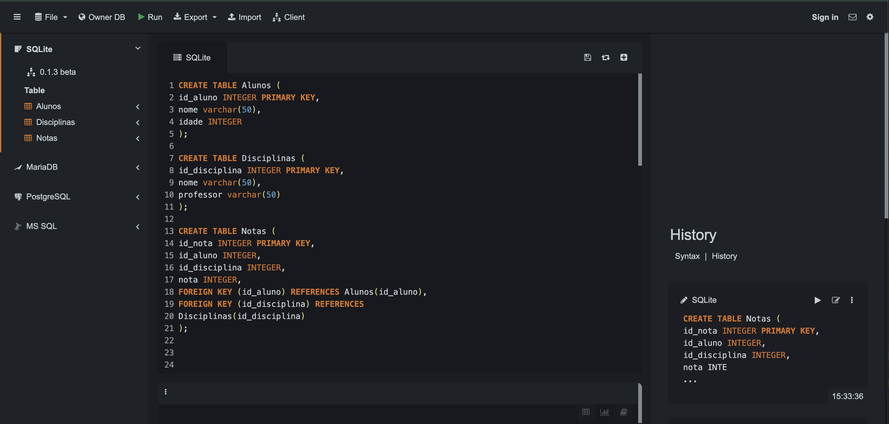
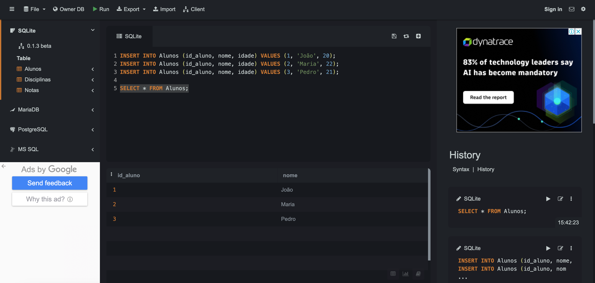
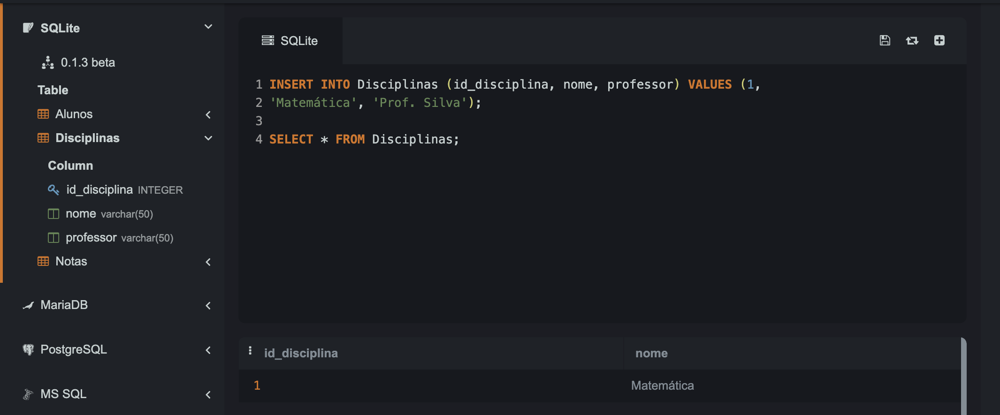
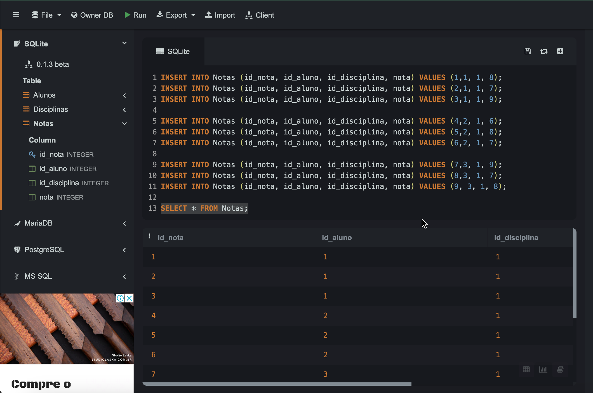
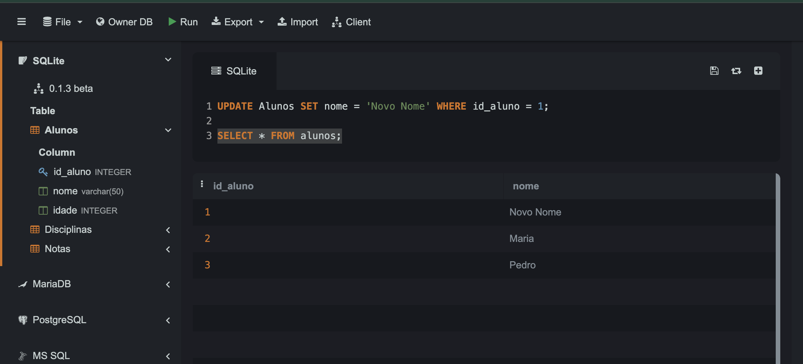
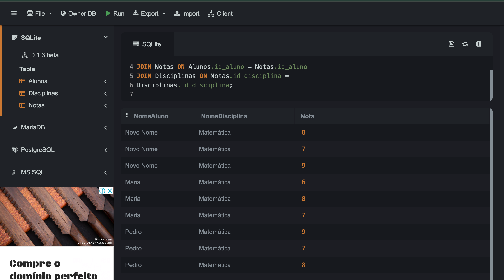
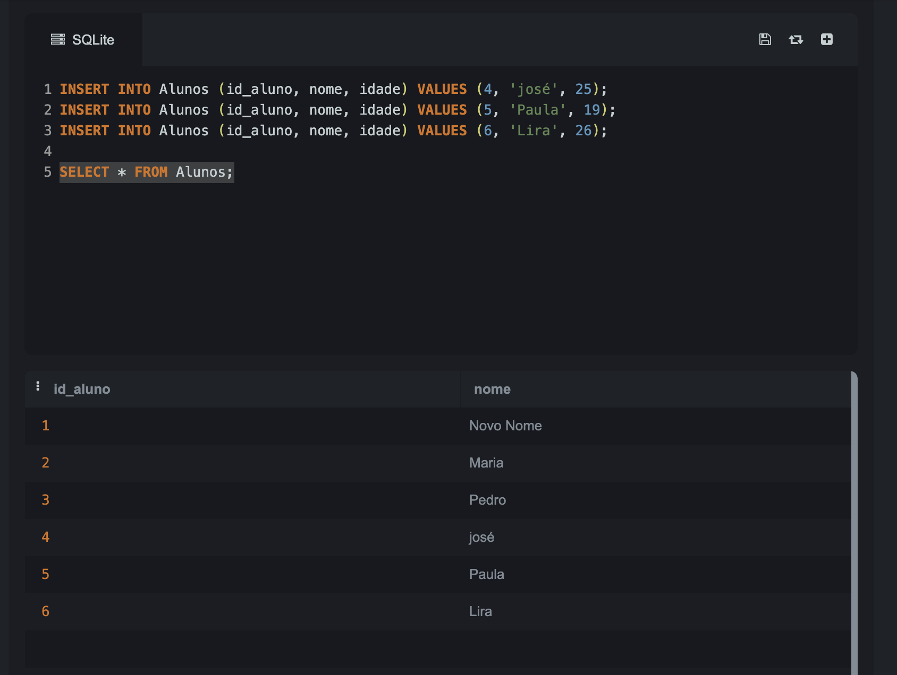
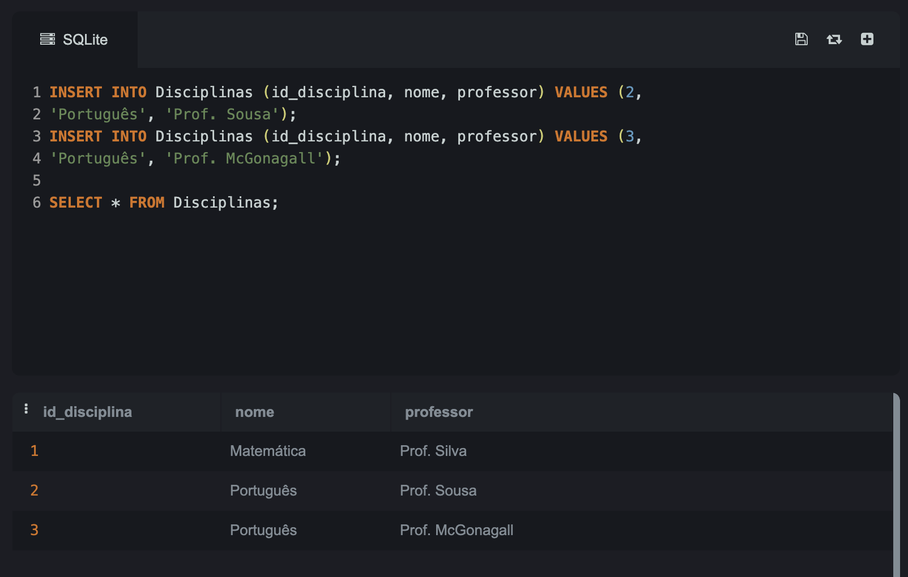
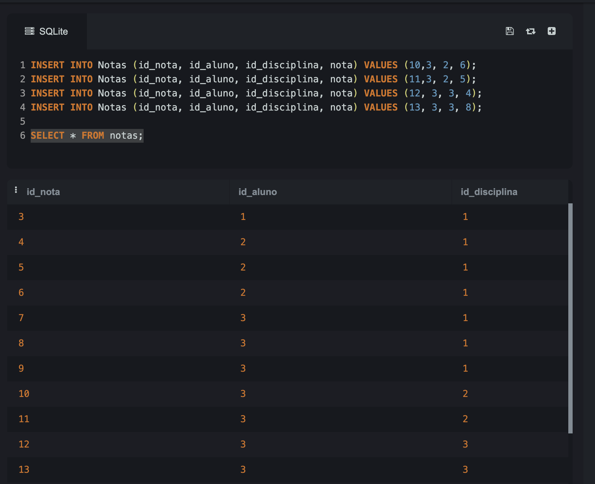
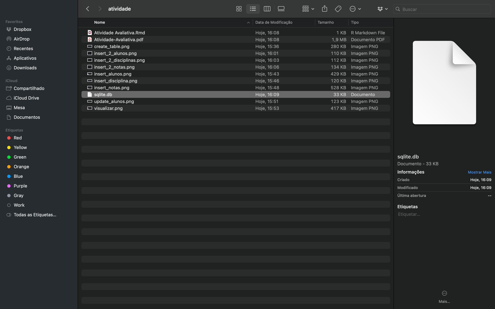

```{=html}
<style>body {text-align: justify}</style>
```
```{r setup, include=FALSE}
knitr::opts_chunk$set(echo = TRUE)
```


## Questão 1. Na ferramenta SQLite IDE, crie e execute os scripts do BD disponíveis em [google drive](https://docs.google.com/document/d/1_ebLMDXezQl8xBTJn7a9LKbeIsNTbvIEYxSeqMuZbhc/edit?usp=drive_link).

### Solução 1:

- Passo 1: Criar as tabelas.



- Passo 2: Inserir dados na tabela Alunos.



- Passo 3: Inserir dados na tabela Disciplina.




- Passo 4: Inserir dados na tabela Notas.



- Passo 5: Update de dados na tabela Alunos.



- Passo 6: Visualizando as tabelas interligadas.




## Questão 2. Na ferramenta SQLite IDE, insira linhas em todas as tabelas do BD criado.

### Solução 2:
- Passo 1: Insert na tabela Alunos.



- Passo 2: Insert na tabela Disciplinas.



- Passo 3: Insert na tabela Notas.



- Passo 3: Insert na tabela Alunos.


## Questão 3. Na ferramenta SQLite, gere o BD na forma de um arquivo e armazene-o em uma pasta/diretório no seu computador.

### Solução 3:



## Questão 4. No R, faça a conexão com o BD usando o arquivo gerado no enunciado 3.

### Solução 4:

```{r}
library("RSQLite")
setwd("/Users/anamaria/especializacao/modulo_2/atividade/")
conexao <- RSQLite::dbConnect(RSQLite::SQLite(), dbname = "sqlite.db")
```


```{r}
DBI::dbListTables(conexao)
```

## Questão 5. No R, construa três consultas SQL selecionando diretamente do BD linhas das tabelas utilizando a cláusula WHERE.

### Solução 5:

```{sql}
--| connection = conexao
-- Consulta na tabela Alunos
SELECT * FROM Alunos where nome ='Paula';
```

```{sql}
--| connection = conexao
-- Consulta na tabela Disciplina
SELECT * FROM Disciplinas where nome ='Português';
```


```{sql}
--| connection = conexao
-- Consulta na tabela Notas
SELECT * FROM Notas where nota > 8;
```

## Questão 6. No R, faça a importação das tabelas para data frames.

### Solução 6:

- Dataframe Alunos:
```{r}
library("dplyr")
library("tibble")
alunos_tbl <- dplyr::tbl(conexao,"Alunos")
alunos_df <- dplyr::collect(alunos_tbl)
```

```{r}
alunos_df
```

- Dataframe Disciplinas:
```{r}
disciplinas_tbl <- dplyr::tbl(conexao,"Disciplinas")
disciplinas_df <- dplyr::collect(disciplinas_tbl)
```

```{r}
disciplinas_df
```

- Dataframe Notas:
```{r}
notas_tbl <- dplyr::tbl(conexao,"Notas")
notas_df <- dplyr::collect(notas_tbl)
notas_df
```

## Questão 7. No R, faça consultas utilizando select() do pacote dplyr nos objetos tibble correspondentes aos data frames gerados no enunciado 6.

### Solução 7:
```{r}
alunos1 <- dplyr::sql("SELECT * FROM Alunos WHERE idade > 22")
alunos_select <- dplyr::tbl(conexao, alunos1)
alunos_db_select <- dplyr::collect(alunos_select)
alunos_db_select
```

```{r}
disciplinas1 <- dplyr::sql("SELECT * FROM Disciplinas WHERE nome != 'Português'")
disciplinas_select <- dplyr::tbl(conexao, disciplinas1)
disciplinas_db_select <- dplyr::collect(disciplinas_select)
disciplinas_db_select
```

```{r}
notas1 <- dplyr::sql("SELECT * FROM Notas WHERE nota <= 6")
notas_select <- dplyr::tbl(conexao, notas1)
notas_db_select <- dplyr::collect(notas_select)
notas_db_select
```

## Questão 8.(opcional) Realize o mesmo processo (enunciados 2 até 7) para o BD "Animais de uma Fazenda", disponível em [google drive](https://drive.google.com/file/d/1manYTl1tuIXJYyc0jsub7sGmrS4AuGgD/view?usp=drive_link) (páginas 22 a 25, apostila de SQllite).

### Solução 8:

Para questão de otimização do relatório, irei omitir os prints da criação do BD. O BD estará anexado no arquivo compactado que está anexado.

- Conectando no BD

```{r}
conexao_animal <- RSQLite::dbConnect(RSQLite::SQLite(), dbname = "animal.db")
```

- Realizar consultas utilizando a cláusula *Where*

```{sql}
--| connection = conexao_animal
-- Consulta na tabela Animal
SELECT * FROM Animal where peso_desm <= 200;
```

```{sql}
--| connection = conexao_animal
-- Consulta na tabela Fazenda
SELECT * FROM Fazenda where id_faz = 1;
```

```{sql}
--| connection = conexao_animal
-- Consulta na tabela Vacina
SELECT * FROM  Vacina where data_venc <= '2024-02-01';
```

```{sql}
--| connection = conexao_animal
-- Consulta na tabela Vacinacao
SELECT * FROM  Vacinacao where data_vacinacao <= '2022-09-15';
```

- Importação das tabelas para dataframes.
```{r}
animal_tbl <- dplyr::tbl(conexao_animal,"Animal")
animal_df <- dplyr::collect(animal_tbl)
animal_df
```

```{r}
fazenda_tbl <- dplyr::tbl(conexao_animal,"Fazenda")
fazenda_df <- dplyr::collect(fazenda_tbl)
fazenda_df
```

```{r}
vacina_tbl <- dplyr::tbl(conexao_animal,"Vacina")
vacina_df <- dplyr::collect(vacina_tbl)
vacina_df
```

```{r}
vacinacao_tbl <- dplyr::tbl(conexao_animal,"Vacinacao")
vacinacao_df <- dplyr::collect(vacinacao_tbl)
vacinacao_df
```

- Faça consultas utilizando select() do pacote dplyr nos objetos tibble correspondentes aos data frames gerados no item anterior.

```{r}
animais1 <- dplyr::sql("SELECT * FROM Animal WHERE data_nasc <= '2022-03-01'")
animais_select <- dplyr::tbl(conexao_animal, animais1)
animais_db_select <- dplyr::collect(animais_select)
animais_db_select
```

```{r}
vacina1 <- dplyr::sql("SELECT * FROM vacina WHERE id_vacina <= 2")
vacina_select <- dplyr::tbl(conexao_animal, vacina1)
vacina_db_select <- dplyr::collect(vacina_select)
vacina_db_select
```

```{r}
vacinacao1 <- dplyr::sql("SELECT * FROM vacinacao WHERE nome_aplicador = 'Aplicador 1'")
vacinacao_select <- dplyr::tbl(conexao_animal, vacinacao1)
vacinacao_db_select <- dplyr::collect(vacinacao_select)
vacinacao_db_select
```

## Questão 9.(opcional) Realize o mesmo processo (enunciados 2 até 7) para o BD cujo modelo está disponível no slide 37 disponível em [google drive](https://drive.google.com/file/d/1DcMGlIaxX4qhcYUZtfwrpOM5A3tm4_mr/view?usp=drive_link)

### Solução 9:

A solução é igual a solução do item 8, mudando apenas as tabelas do BD e sendo necessário criar os scripts para gerar o bd similar ao que foi realizado na questão 10.

## Questão 10. Considere o BD descrito no [Link](https://docs.google.com/document/d/1aeXm28RG-LOCD8nKd9ivhtImiTymc5mU1a_PFHvs19Y/edit). Realize o mesmo processo (enunciados 2 até 7) para este BD. Além disso,  execute as dez operações propostas (que estão nos exercícios de integridade) e discuta as restrições de integridade violadas por cada operação (se houver alguma, dada uma operação ela viola alguma coisa?), e as diferentes maneiras de lidar com essas restrições.

### Solução 10:
- Passo 1: criar as tabelas do banco de dados. 
As tabelas, bem como o banco de dados, serão criados no [sqllite](https://sqliteonline.com/) mas para manter o arquivo organizado, iremos importar apenas o BD gerado no Sqllite e colocaremos os comandos usados no Sqllite para gerar o BD. 

1. Criação das tabelas:

```sql
-- Tabela Funcionário
CREATE TABLE FUNCIONARIO (
    Cpf VARCHAR(11) PRIMARY KEY,
    Pnome VARCHAR(255),
    Minicial CHAR(1),
    Unome VARCHAR(255),
    Datanasc DATE,
    Endereco VARCHAR(255),
    Sexo CHAR(1),
    Salario DECIMAL(10, 2),
    Cpf_supervisor VARCHAR(11),
    Dnr INT,
    FOREIGN KEY (Cpf_supervisor) REFERENCES FUNCIONARIO(Cpf),
    FOREIGN KEY (Dnr) REFERENCES DEPARTAMENTO(Dnumero)
);
```

```sql
-- Tabela Departamento
CREATE TABLE DEPARTAMENTO (
    Dnumero INT PRIMARY KEY,
    Dnome VARCHAR(255),
    Cpf_gerente VARCHAR(11),
    Data_inicio_gerente DATE,
    FOREIGN KEY (Cpf_gerente) REFERENCES FUNCIONARIO(Cpf)
);
```

```sql
-- Tabela Localizações
CREATE TABLE LOCALIZACOES_DEP (
    Dnumero INT,
    Dlocal VARCHAR(255),
    PRIMARY KEY (Dnumero, Dlocal),
    FOREIGN KEY (Dnumero) REFERENCES DEPARTAMENTO(Dnumero)
);
```

```sql
-- Tabela Projeto
CREATE TABLE PROJETO (
    Projnumero INT PRIMARY KEY,
    Projnome VARCHAR(255),
    Projlocal VARCHAR(255),
    Dnum INT,
    FOREIGN KEY (Dnum) REFERENCES DEPARTAMENTO(Dnumero)
);
```

```sql
-- Tabela Trabalha
CREATE TABLE TRABALHA_EM (
    Fcpf VARCHAR(11),
    Pnr INT,
    Horas DECIMAL(5, 2),
    PRIMARY KEY (Fcpf, Pnr),
    FOREIGN KEY (Fcpf) REFERENCES FUNCIONARIO(Cpf),
    FOREIGN KEY (Pnr) REFERENCES PROJETO(Projnumero)
);
```

```sql
-- Tabela Dependente
CREATE TABLE DEPENDENTE (
    Fcpf VARCHAR(11),
    Nome_dependente VARCHAR(255),
    Sexo CHAR(1),
    Datanasc DATE,
    Parentesco VARCHAR(255),
    PRIMARY KEY (Fcpf, Nome_dependente),
    FOREIGN KEY (Fcpf) REFERENCES FUNCIONARIO(Cpf)
);
```

2. Inserção dos dados nas tabelas correspondentes:

```sql
-- Inserção de dados na tabela funcionário:
INSERT INTO FUNCIONARIO (Cpf, Pnome, Minicial, Unome, Datanasc, Endereco, 
Sexo, Salario, Cpf_supervisor, Dnr) VALUES
('12345678966', 'João', 'B', 'Silva', '1965-01-09', 'Rua das Flores, 751, São Paulo, SP', 
'M', 30000, '33344555587', 5),
('33344555587', 'Fernando', 'T', 'Wong', '1955-12-08', 'Rua da Lapa, 34, São Paulo, SP', 
'M', 40000, '88866555576', 5),
('9988777767', 'Alice', 'J', 'Zelaya', '1968-01-19', 'Rua Souza Lima, 35, Curitiba, PR', 
'F', 25000, '98765432168', 4),
('98765432168', 'Jennifer', 'S', 'Souza', '1941-06-20', 'Av. Arthur de Lima, 54, Santo André, SP',
'F', 43000, '88866555576', 4),
('66688444476', 'Ronaldo', 'K', 'Lima', '1962-09-15', 'Rua Rebouças, 65, Piracicaba, SP', 
'M', 38000, '33344555587', 5),
('45345345376', 'Joice', 'A', 'Leite', '1972-07-31', 'Av. Lucas Obes, 74, São Paulo, SP', 
'F', 25000, '33344555587', 5),
('98798798733', 'André', 'V', 'Pereira', '1969-03-29', 'Rua Timbira, 35, São Paulo, SP', 
'M', 25000, '98765432168', 4),
('88866555576', 'Jorge', 'E', 'Brito', '1937-10-11', 'Rua do Horto, 35, São Paulo, SP', 
'M', 55000, NULL, 1);
```

```sql
-- Inserção Tabela Departamento
INSERT INTO DEPARTAMENTO (Dnumero, Dnome, Cpf_gerente, Data_inicio_gerente) VALUES
(1, 'Matriz', '88866555576', '1988-06-19'),
(4, 'Administração', '98765432168', '1995-01-01'),
(5, 'Pesquisa', '33344555587', '1988-05-22');
```

```sql
-- Inserção na Tabela de Localizacao_dep
INSERT INTO LOCALIZACOES_DEP (Dnumero, Dlocal) VALUES
(1, 'São Paulo'),
(4, 'Mauá'),
(5, 'Santo André'),
(5, 'Itu'),
(5, 'São Paulo');
```

```sql 
-- Inserção na Tabela TRABALHA_EM
INSERT INTO TRABALHA_EM (Fcpf, Pnr, Horas) VALUES
('12345678966', 1, 32.5),
('12345678966', 2, 7.5),
('66688444476', 3, 40.0),
('45345345376', 1, 20.0),
('45345345376', 2, 20.0),
('33344555587', 2, 10.0),
('33344555587', 3, 10.0),
('33344555587', 10, 10.0),
('33344555587', 20, 10.0),
('99988777767', 30, 30.0),
('99988777767', 10, 10.0),
('98798798733', 10, 35.0);
```

```sql 
-- Inserção na Tabela Projeto
INSERT INTO PROJETO (Projnumero, Projnome, Projlocal, Dnum) VALUES
(1, 'ProdutoX', 'Santo André', 5),
(2, 'ProdutoY', 'Itu', 5),
(3, 'ProdutoZ', 'São Paulo', 5),
(10, 'Informatização', 'Mauá', 4),
(20, 'Reorganização', 'São Paulo', 1),
(30, 'Novosbeneficios', 'Mauá', 4);
```

```sql
-- Inserção na Tabela Dependente
INSERT INTO DEPENDENTE (Fcpf, Nome_dependente, Sexo, Datanasc, Parentesco) VALUES
('33344555587', 'Alicia', 'F', '1986-05-04', 'Filha'),
('33344555587', 'Tiago', 'M', '1983-10-25', 'Filho'),
('33344555587', 'Janaina', 'F', '1958-03-05', 'Esposa');
```

- Passo 2: exportar o Banco de Dados com as tabela acima em um arquivo .bd e realizar testes e consultas SQL.

1. Fazer a conexão do banco de dados usando o arquivo gerado através da exportação no SQLlite.

```{r} 
conexao_restricao <- RSQLite::dbConnect(RSQLite::SQLite(), dbname = "restricao.db")
```

2. Construir três consultas SQL selecionando diretamente do BD linhas das tabelas utilizando a cláusula WHERE.

```{sql}
--| connection = conexao_restricao
select Pnome, Datanasc, Endereco from FUNCIONARIO where datanasc >= '1965-01-01';
```

```{sql}
--| connection = conexao_restricao
select * from DEPENDENTE where Parentesco in ('Filho', 'Filha');
```

```{sql}
--| connection = conexao_restricao
select Pnome, Minicial, Unome, Salario from FUNCIONARIO where salario > 30000;
```

3. Fazer a importação das tabelas do BD criado para data frames.

```{r}
departamento_tbl <- dplyr::tbl(conexao_restricao,"Departamento")
departamento_df <- dplyr::collect(departamento_tbl)
departamento_df
```

```{r}
dependente_tbl <- dplyr::tbl(conexao_restricao,"Dependente")
dependente_df <- dplyr::collect(dependente_tbl)
dependente_df
```

```{r}
funcionario_tbl <- dplyr::tbl(conexao_restricao,"Funcionario")
funcionario_df <- dplyr::collect(funcionario_tbl)
funcionario_df
```

```{r}
localizacao_tbl <- dplyr::tbl(conexao_restricao,"Localizacoes_Dep")
localizacao_df <- dplyr::collect(localizacao_tbl)
localizacao_df
```

```{r}
projeto_tbl <- dplyr::tbl(conexao_restricao,"Projeto")
projeto_df <- dplyr::collect(projeto_tbl)
projeto_df
```

```{r}
trabalha_tbl <- dplyr::tbl(conexao_restricao,"Trabalha_EM")
trabalha_df <- dplyr::collect(trabalha_tbl)
trabalha_df
```

4. Faça consultas utilizando select() do pacote dplyr nos objetos tibble correspondentes aos data frames gerados no item anterior.

*Obs:* Com o objetivo de ser mais sucinta, realizei uma única consulta realacionando as tabelas do BD entre si.

```{r}
sql_rest <- dplyr::sql("SELECT 
    F.Cpf, 
    F.Pnome, 
    F.Unome, 
    D.Dnome AS Departamento, 
    P.Projnome AS Projeto, 
    TE.Horas AS Horas_Trabalhadas, 
    Dep.Nome_dependente AS Dependente,
    Dep.Parentesco
FROM 
    FUNCIONARIO F
LEFT JOIN 
    DEPARTAMENTO D ON F.Dnr = D.Dnumero
LEFT JOIN 
    TRABALHA_EM TE ON F.Cpf = TE.Fcpf
LEFT JOIN 
    PROJETO P ON TE.Pnr = P.Projnumero
LEFT JOIN 
    DEPENDENTE Dep ON F.Cpf = Dep.Fcpf
")
restricao_select <- dplyr::tbl(conexao_restricao, sql_rest)
restricao_select_df <- dplyr::collect(restricao_select)
restricao_select_df
```

- Passo 3: Executar as 10 operações propostas, discutir as restrições de integridade violadas por cada operação e as diferentes maneiras de lidar com essas restrições.


1. Inserir <‘Roberto’, ‘F’, ‘Santos’, ‘94377554355’, ‘21-06-1972’, ‘Rua Benjamin, 34, Santo André, SP’, M, 58.000, ‘88866555576’, 1> em FUNCIONARIO.

```sql
Insert into FUNCIONARIO values 
(‘Roberto’, ‘F’, ‘Santos’, ‘94377554355’, ‘21-06-1972’, ‘Rua Benjamin, 34, Santo André, 
'SP', M, 58.000, ‘88866555576’, 1);
```
**Discussão:**

i. Da maneira que os dados estão formatados, haverá problema com a correspondencia das tabelas, isso é, inserir o dado correto na tabela correta. Para corrigir esse problema, devemos dizer a sequencia correta das tabelas nas quais os dados serão inseridos.

ii. Observamos também que o formato da data está diferente do formato da data que está na tabela FUNCIONARIO, sendo necessário realizar o ajuste da data para o mesmo formato da tabela. Será necessário ajustar também o salário para a formatação correta.

iii. Com a discução acima, a inserção correta, sem violar as restrições seria:
```sql
INSERT INTO FUNCIONARIO 
(Pnome, Minicial, Unome, Cpf, Datanasc, Endereco, Sexo, Salario, Cpf_supervisor, Dnr) 
VALUES ('Roberto', 'F', 'Santos', '94377554355', '1972-06-21', 
'Rua Benjamin, 34, Santo André, SP', 'M', 58000, '88866555576', 1);
```

2. Inserir <‘ProdutoA’, 4, ‘Santo André’, 2> em PROJETO.

```sql
INSERT INTO PROJETO VALUES (‘ProdutoA’, 4, ‘Santo André’, 2);
````

**Discussão:**

i. Da maneira que os dados estão formatados, haverá problema com a correspondencia das tabelas, isso é, inserir o dado correto na tabela correta. Para corrigir esse problema, devemos dizer a sequencia correta das tabelas nas quais os dados serão inseridos.

ii. Inserção ajustada:
```sql
INSERT INTO PROJETO (projnome, projnumero, projlocal, dnum) VALUES 
('ProdutoA', 4, 'Santo André', 2);
```

3. Inserir <‘Producao’, 4, ‘94377554355’, ‘01-10-2007’> em DEPARTAMENTO.

```sql
INSERT INTO DEPARTAMENTO VALUES ('Producao', 4, '94377554355', '01-10-2007');
```

**Discussão:**

i. Da maneira que os dados estão formatados, haverá problema com a correspondencia das tabelas, isso é, inserir o dado correto na tabela correta. Para corrigir esse problema, devemos dizer a sequencia correta das tabelas nas quais os dados serão inseridos ou alterar a ordem dos dados a serem inseridos para que corresponda a ordem das colunas das tabelas.

ii. Nessa inserção temos violação de chave primária uma vez que Dnumero é a chave primária da tabela e o valor 4 já está sendo usado, isso é, atribuido a outro departamento. Para corrigir esse problema deveremos mudar o valor da chave primária que estamos inserindo.

iii. Formatação da data na inserção não corresponde a formatação da data na tabela DEPARTAMENTO sendo necessário realizar a correção.

iv. Inserção corrigida:
```sql
INSERT INTO DEPARTAMENTO values (2, 'Producao', '94377554355', '2007-10-01');
```

4. Inserir <‘67767898944’, NULL, ‘40,0’> em TRABALHA_EM.

```sql
INSERT INTO TRABALHA_EM VALUES (‘67767898944’, NULL, ‘40,0’);
```

**Discussão**

i. Temos violação de chave secundária, pois ela não pode ser nula. Parra corrigir, inserir um valor. 

ii. A formatação das horas  estão incoerentes com a formatação da coluna da tabela.

iii. Correção:
```sql
INSERT INTO TRABALHA_EM VALUES ('67767898944', 4, 40.0);
```

5. Inserir <‘45345345376’, ‘João’, ‘M’, ‘12-12-1990’, ‘marido’> em DEPENDENTE.

```sql
INSERT INTO DEPENDETE VALUES (‘45345345376’, ‘João’, ‘M’, ‘12-12-1990’, ‘marido’);
```

**Discussão**

i. Da maneira que os dados estão formatados, haverá problema com a correspondencia das tabelas, isso é, inserir o dado correto na tabela correta. Para corrigir esse problema, devemos dizer a sequencia correta das tabelas nas quais os dados serão inseridos ou alterar a ordem dos dados a serem inseridos para que corresponda a ordem das colunas das tabelas.

ii. A formatação da data está incoerente com a formatação da coluna correspondente na tabela.

iii. Correção:
```sql
INSERT INTO DEPENDENTE VALUES ('45345345376', 'João', 'M', '1990-12-12', 'Marido');
```

6. Excluir as linhas de TRABALHA_EM com Fcpf = ‘33344555587’.

```sql
DELETE FROM TRABALHA_EM where Fcpf = '33344555587';
```

**Discussão**

i. Nesse caso, não há problemas pois da maneira que criamos a tabela TRABALHA_EM, Fcpf é uma chave estrangeira exportada da tabela FUNCIONARIO. Haveria problemas se Fcpf fosse uma chave primária que é referenciada em outras tabelas.

7. Excluir a linha de FUNCIONARIO com Cpf = ‘98765432168’.
```sql 
DELETE FROM FUNCIONARIO WHERE Cpf = '98765432168';
```

**Discussão**

i. Como Cpf é a chave primária da tabela FUNCIONARIO, haverá problemas ao excluir os registros se, e somente se, esse registro for usado em alguma das outras tabelas como chave secundária.

8. Excluir a linha de PROJETO com Projnome = ‘ProdutoX’.

```sql
DELETE FROM PROJETO WHERE Projnome = 'ProdutoX';
```

**Discussão**

i. Nesse caso, não há problemas pois da maneira que criamos a tabela PROJETO, Projnome não é chave primária.

9. Modificar Cpf_gerente e Data_inicio_gerente da linha DEPARTAMENTO com Dnumero = 5 para ‘12345678966’ e ‘01-10-2007’, respectivamente. Modificar o atributo Cpf_supervisor da linha FUNCIONARIO com Cpf = ‘99988777767’ para ‘94377554355’.

```sql

UPDATE DEPARTAMENTO
SET Cpf_gerente = '12345678966', Data_inicio_gerente = '2007-10-01'
WHERE Dnumero = 5;

UPDATE FUNCIONARIO
SET Cpf_supervisor = '94377554355'
WHERE Cpf = '99988777767';
```

**Discussão:**

i. Haveria problema em realizar essas modificações se o CPF_gerente ou CPF_supervisor informados já estivessem atribuidos a outra pessoa na tabela de FUNCIONARIOS, uma vez que CPF é a chave primaria desta tabela e chave secundaria nas demais tabelas.

10. Modificar o atributo Horas da linha TRABALHA_EM com Fcpf = ‘99988777767’ e Pnr = 10 para ‘5,0’.
```sql
UPDATE TRABALHA_EM
SET Horas = 5.0 
WHERE Fcpf = '99988777767' AND Pnr = 10;
```

**Discussão:**

i. Não há restrição sendo violada ao realizar essa atualização na tabela.

## Questão 11. Considere os data sets imdb disponíveis [google drive](https://drive.google.com/drive/folders/1CkVbB02B1Rltl2FiEtgzxRxHN4nnqLGE?usp=drive_link). Quais as diferenças entre imdb.csv, imdb.sqlite e imdb.rds?

### Solução 11:

Os três formatos informados são maneiras diferentes de armazenar dados relacionados ao IMDb. 

O formato **csv** (Comma-Separated Values) armazena os dados de maneira tabular, onde cada linha do arquivo é um registro de dados, e cada campo é separado por uma vírgula ou outro delimitador especificado mas não suporta relações entre tabelas além de não ser eficiente para grandes volumes de dados. É comumente usado para armazenar dataframes que são uma estrutura de dados que organiza os dados em uma tabela bidimensional de linhas e colunas, como uma planilha. 

O formato **sqlite** é um arquivo de banco de dados SQLite. Diferente do formato csv, o sqlite é um sistema de gerenciamento de banco de dados relacional contido em uma biblioteca de programação C. Um arquivo .sqlite contém o banco de dados inteiro, isto é, inclui todas as informações daquele banco de dados como tabelas, índices, triggers e outras informações. Além disso, o sqlite suporta relações complexas entre dados sendo uma solução portátil que não necessita de um servidor de banco de dados separado.

O formato **rds** (R Data File) é um arquivo específico do R sendo utilizado para armazenar objetos de dados R, como dataframes, listas, modelos estatísticos, etc preservando a estrutura dos dados e metadados. Este formato permite que os usuários de R salvem e carreguem objetos em ou para o ambiente R de maneira eficiente mas só possuí compatibilidade com o R, diferentemente dos outros dois formatos mencionados que possui compatibilidade com diversas ferramentas.

## Questão 12. Qual dos 3 imdb (csv, sqlite, rds), você consegue abrir e manipular na ferramenta SQLite IDE? Por quê?

### Solução 12:

Apenas o arquivo no formato rds não é possível abrir e manipular na ferramenta SQLite IDE pois arquivos nesse formato são compatíveis apenas com o R, conforme mencionado na questão anterior. 

Como o SQLite IDE é projetado especificamente para interagir com bancos de dados SQLite, permitindo visualizar, editar, e gerenciar dados armazenados em arquivos .sqlite, o arquivo .sqlite permite abrir e manipular nessa ferramenta.

Embora seja possível importar e manipular arquivos .csv no SQLite IDE vale resaltar que neste caso teremos uma tabela de um banco de dados e não o banco de dados completo.

## Questão 13. Quais dos 3 imdb (csv, sqlite, rds), você consegue importar para o R e trabalhar como data frames ou mesmo tibbles? Escreva os scripts necessários para realizar a importação de cada um deles. Mostre ainda instruções de manipulação dos data frames e tibbles resultantes da importação.

### Solução 13:

No ambiente R, podemos importar e manipular dados em qualquer um dos três formatos imdb.csv, imdb.sqlite, e imdb.rds. No entanto, cada formato necessita de uma abordagem diferente para importação e manipulação subsequente como dataframes ou tibbles.

- Abordagem para csv:
```{r}
library(readr)
imdb_csv <- read_csv("/Users/anamaria/especializacao/modulo_2/atividade/imdb.csv")
imdb_csv[2,3]
```

- Abordagem para SQLite:
```{r}
conexao_sqlite <- dbConnect(RSQLite::SQLite(), 
  dbname = "/Users/anamaria/especializacao/modulo_2/atividade/imdb.sqlite")

imdb_sqlite <- dbReadTable(conexao_sqlite, "imdb")
```

```{sql}
--| connection = conexao_sqlite
SELECT titulo, duracao, diretor, ano FROM imdb where duracao > 190;
```

- Abordagem para rds:
```{r}
imdb_rds <- readRDS("/Users/anamaria/especializacao/modulo_2/atividade/imdb.rds")
names(imdb_rds)
```
## Questão 14. Considere o data set Melanoma.xlsx disponível [google drive](https://drive.google.com/drive/folders/1CkVbB02B1Rltl2FiEtgzxRxHN4nnqLGE?usp=drive_link.) a) Faça a importação do data set para o R; b) realize operações de manipulação do data frame e do tibble; e c) faça consultas usando SQL.

### Solução 14:
- Parte a: importação dos dados
```{r}
library(readxl)
melanoma_data <- read_excel("/Users/anamaria/especializacao/modulo_2/atividade/Melanoma.xlsx")
head(melanoma_data)
```

- Parte b: operações de manipulação

```{r}
library("dplyr")
melanoma_tibble <- as_tibble(melanoma_data)
melanoma_selected <- select(melanoma_tibble, sex, age)
melanoma_selected
melanoma_filtered <- filter(melanoma_tibble, age >= 68)
melanoma_filtered
melanoma_arranged <- arrange(melanoma_tibble, age)
melanoma_arranged

```

- Parte c: Consultas usando SQL

```{r}
library(sqldf)
result_sql <- sqldf("SELECT * FROM melanoma_tibble WHERE age > 85 AND status = 3")
head(result_sql)

```

## Questão 15 (opcional). Considere o data set imdb.csv disponível [google drive](https://drive.google.com/drive/folders/1CkVbB02B1Rltl2FiEtgzxRxHN4nnqLGE?usp=drive_link). a) Faça a importação do data set para o R; b) realize operações de manipulação do data frame e do tibble; e c) faça consultas usando SQL.

### Solução 15:

- Parte a: observe que na questão 12 esse data set já foi importado como imdb_csv. Portanto, não farei uma nova importação.

- Parte b: operações de manipulação
```{r}
imdb_subset <- imdb_csv[imdb_csv$ano > 2019, 2]
imdb_subset
```

```{r}
library("dplyr")
imdb_tibble <- as_tibble(imdb_csv)
imdb_tibble_filter <-  filter(imdb_tibble, generos == 'Drama')
imdb_tibble_filter
```
- Parte c: Consultas usando SQL

```{r}
library(sqldf)
result_imdb_sql <- sqldf("SELECT titulo, ano, generos,idioma from imdb_tibble 
                  WHERE idioma !='English' and generos == 'Comedy' and ano > 2015")
result_imdb_sql

```

## Questão 16(opcional). Considere o data set [cancer_cerebro.csv](https://drive.google.com/drive/folders/1CkVbB02B1Rltl2FiEtgzxRxHN4nnqLGE?usp=drive_link). a) Faça a importação do data set para o R; b) realize operações de manipulação do data frame e do tibble; e c) faça consultas usando SQL.

### Solução 16:

- Parte a: importação dos dados

```{r}
library(readr)
cancer_cerebro <- read_csv("/Users/anamaria/especializacao/modulo_2/atividade/cancer_cerebro.csv")
colnames(cancer_cerebro)
```

- Parte b: operações e manipulações

```{r}
cancer_subset <- cancer_cerebro[cancer_cerebro$FAIXAETAR == '30-39', ]
cancer_subset
```

```{r}
library("dplyr")
cerebro_tibble <- as_tibble(cancer_cerebro)
cerebro_tibble_filter <-  filter(cerebro_tibble, ANODIAG == 2014 & TRATHOSP == 'B')
cerebro_tibble_filter
```
- Parte c: Consultas usando SQL

```{r}
library(sqldf)
result_cerebro_sql <- sqldf("SELECT CATEATEND, ANODIAG, TRATHOSP, DIAGTRAT, FAIXAETAR, TEMPO 
  from cerebro_tibble WHERE ANODIAG == 2010 and FAIXAETAR == '20-29' and DIAGTRAT != 0")
result_cerebro_sql

```