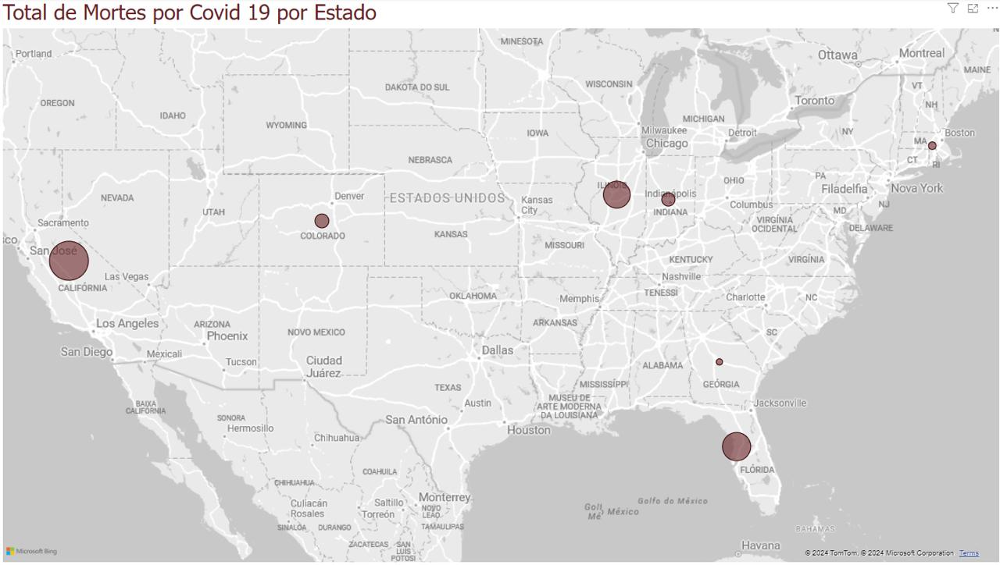
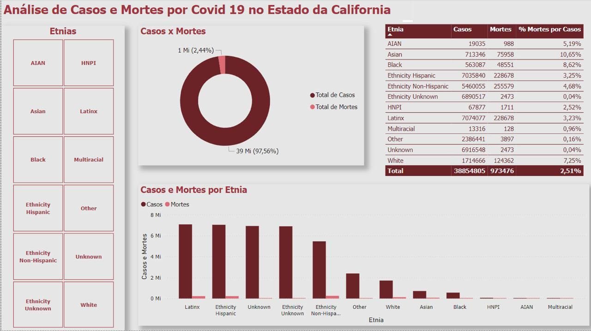

```{r setup, include=FALSE}
knitr::opts_chunk$set(echo = TRUE, warning = FALSE)
```

```{r libraries, echo=FALSE, warning = FALSE, message=FALSE}

library(readxl)
library(dplyr)
library(tidyr)
library(lubridate)
library(car)
library(tidyverse)
```


# Questões discursivas
## Questão 1: Comente brevemente sobre a importância do processamento paralelo para a manipulação de Big Data.
### Solução: 
Processamento paralelo é uma metodologia que permite que dois ou mais processadores de um computador sejam usados para trabalhar em partes separadas de uma tarefa diminuindo o tempo gasto na resolução do problema. Sendo assim, o processamento paralelo torna-se uma ferramenta muito útil para a manipulação de Big Data devido ao grande volume e complexidade dos dados que precisam ser processados. 

Esse tipo de processamento permite que múltiplas operações sejam executadas simultaneamente, distribuindo tarefas entre vários núcleos de processamento (CPUs ou até GPUs), distribuindo os recursos do computador ou servidor de forma eficiente fazendo que os dados sejam processados tanto pela CPU, memória RAM e até o GPU's. Isso resulta em uma redução significativa no tempo de processamento e permite lidar com conjuntos de dados que não caberiam na memória de uma única máquina. 

Além disso, o processamento paralelo reduz significativamente o tempo de execução de operações complexas, como agregações, filtragens e cálculos intensivos, que seriam impraticáveis de realizar sequencialmente em datasets de grande escala devido ao uso eficiente dos recursos do computador/servidor.

## Questão 2: Como o uso de consultas SQL com o BigQuery pode facilitar a manipulação de Big Data?
### Solução: 
O uso de consultas SQL com o BigQuery facilita a manipulação de Big Data ao permitir que grandes volumes de dados sejam analisados rapidamente sem a necessidade de infraestrutura local complexa. O BigQuery é um  otimizado para processamento em larga escala. Além disso, SQL é uma linguagem universal na consulta de dados devido a dinamicidade.

Com o BigQuery, podemos escrever consultas SQL padrão para executar análises complexas de forma intuitiva, aproveitando a escalabilidade e o processamento paralelo de dados que o BigQuery oferece, como vimos na questão anterior, o processamento paralelo tem bastante significancia no processamento de Big Data. Esse serviço otimiza automaticamente o uso de recursos e executa consultas em tempo real, simplificando o trabalho com grandes datasets, especialmente para operações como agregações, joins e transformações. Otimizando o uso de recursos da máquina física como memória ram e processador. 

Através de consultas SQL com o BigQuery, é possível realizar modelos de machine learning.

# Questões práticas
## Questão 3: Identifique o total de óbitos por estado. Apresente uma screenshot de uma visualização em forma de mapa, feita no PowerBI, apontando os estados e a quantidade de óbitos em forma de bolhas (quanto mais casos, maior a bolha).
### Solução: 
Para identificar o total de óbitos por estado no PowerBI usaremos um gráfico de mapas. Para isso, foi necessário carregar os dados 'city_level_cases_and_deaths.csv' no Powerbi usando o campo obter dados, fonte de dados comuns e escolher a opção Texto/CSV. Após carregar os dados, foi necessário escolher o tipo de gráfico desejado, escolher as colunas necessárias para a análise colocando a coluna state no campo de localização e colocando a coluna deaths_total no campo tamanho da bolha. Para termos a quantidade de óbitos por estado, é necessário na coluna deaths_total escolher a opção Soma para esses dados.. O gráfico gerado foi:



Pelo gráfico gerado podemos concluir que o estado que possui mais mortes é o estado da California.

## Questão 4: Identifique a tendência de casos e de mortes ao longo do tempo, considerando a informação de novos casos semanais. Apresente o código em R que obtém essas informações e que gera uma visualização dessas tendências ao longo do tempo a partir de um gráfico de linha.
### Solução:

Para isso, inicialmente vamos carregar os dados e observar um resumo deste dados.

```{r}
df <- read.csv("/Users/anamaria/especializacao/modulo_7/atividade_avaliativa/city_level_cases_and_deaths.csv")
```

Para construir um gráfico de tedência de casos e de mortes ao longo do tempo precisaremos considerar as colunas  weekly_new_cases, weekly_new_deaths que trás as informações dos novos casos semanais e novas mortes semanais respectivamente, além da coluna date que trás a data de cada registro. Vamos converter a coluna date para o formato de data pois ela está no formato de character. Para isso, usamos o código:

```{r, echo=TRUE}
df$date <- as.Date(df$date, format = "%Y-%m-%d")
```
Vamos verificar se há datas com valores ausentes e caso haja, vamos remover de nosso dataframe.

```{r, echo=TRUE}
df_new <- df %>% filter(!is.na(date)) %>%
  select(date, weekly_new_cases, weekly_new_deaths)
print(summary(df_new))
```

Agora, se houver valores ausentes nas colunas de casos e mortes, vamos remove-los do dataframe. Como observado no resumo acima, temos que há 90 valores ausentes em cada uma dessas colunas.

```{r, echo=TRUE}
df_new <- df_new %>%
  filter(!is.na(weekly_new_cases) & !is.na(weekly_new_deaths))
print(summary(df_new))
```
Agora vamos agrupar os casos e mortes por semana usando o código:
```{r, echo=TRUE}
df_agrupado <- df_new %>%
  group_by(date) %>%
  summarise(
    weekly_new_cases = sum(weekly_new_cases, na.rm = TRUE),
    weekly_new_deaths = sum(weekly_new_deaths, na.rm = TRUE)
  ) %>%
  arrange(date)

df_agrupado
```

Vamos ver agora, um gráfico de tendência dos novos casos semanais.

```{r, echo=TRUE}
ggplot(df_agrupado, aes(x = date, y = weekly_new_cases)) +
  geom_line(color = "blue") +
  labs(title = "Evolução dos Casos ao Longo do Tempo",
       x = "Data",
       y = "Novos Casos Semanais") +
  theme_minimal()
```

Agora, vejamos o gráfico de tendência de mortes semanais.

```{r, echo=TRUE}
ggplot(df_agrupado, aes(x = date, y = weekly_new_deaths)) +
  geom_line(color = "red") +
  labs(title = "Evolução das Mortes ao Longo do Tempo",
       x = "Data",
       y = "Novas Mortes Semanais") +
  theme_minimal()
```

Agora que já vimos um gráfico com o comportamento do casos e das mortes, vamos juntar essas duas informações em um mesmo gráfico para podermos ter uma análise de como ambos evoluiram ao longo do tempo.

```{r, echo=TRUE}
df_agrupado_2 <- df_agrupado %>%
  pivot_longer(cols = c(weekly_new_cases, weekly_new_deaths),
               names_to = "metric",
               values_to = "value")

ggplot(df_agrupado_2, aes(x = date, y = value, color = metric)) +
  geom_line(size = 1) +
  labs(title = "Evolução dos Casos e Mortes ao Longo do Tempo",
       x = "Data",
       y = "Quantidade",
       color = "Legenda") +
  scale_color_manual(values = c("weekly_new_cases" = "blue", "weekly_new_deaths" = "red"),
                     labels = c("Novos Casos Semanais", "Novas Mortes Semanais")) +
  theme_minimal() +
  theme(
    legend.position = "top",                 # Mover a legenda para o topo
    legend.title = element_text(size = 10),  # Diminuir o tamanho do título da legenda
    legend.text = element_text(size = 8),    # Diminuir o tamanho do texto da legenda
    plot.title = element_text(size = 14, face = "bold"), # Ajustar o tamanho do título
    axis.text = element_text(size = 10),     # Ajustar o tamanho do texto dos eixos
    axis.title = element_text(size = 12)     # Ajustar o tamanho do título dos eixos
  )
```

Observe que ao colocar as duas informações no mesmo gráfico, pouco podemos dizer sobre as novas mortes ou comparar com os novos casos mas ao observar os dois gráficos separadamente podemos observar que as duas informações possuem um comportamento similar ao longo do tempo. Isso é, quando os novos casos diminuem as novas mortes também diminuem e quando os novos casos aumentam as novas mortes também aumentam. Isso se deve ao fato de que proporcionalmente as novas mortes são menores que os novos casos, afetando a escala quando olhamos os dois juntos.

## Questão 5: Identifique a quantidade de casos e de mortes, por etnia, no estado da Califórnia. Apresente a consulta SQL que gera a tabela desejada, e uma screenshot de um dashboard com pelo menos 3 visualizações distintas para suportar essa análise.
### Solução:

Há várias formas de resolver essa questão. Eu particularmente pensei em duas maneiras de obter os dados necessários. A primeira, seria fazer uma consulta SQL no BigQuery estraindo todos os dados filtrando apenas o estado da california. Que seria:

```{r, echo=TRUE, eval=FALSE}
print("
select * from bigquery-public-data.covid19_tracking.city_level_cases_and_deaths
WHERE state = 'CA';
")
```

Após a extração, importar esses dados em formato csv e trata-los no R ou direntamente no PowerBi para agrupar os casos e mortes por etnias e construir as visualizações para suportar a análise.

A segunda opção seria fazer a consulta SQL no BigQuery já tratando de forma a obter uma nova coluna cujos dados sejam as diferentes etnias. Essa foi a opção que eu usei para construir a minha análise. Para isso, usei a seguinte consulta SQl:
```{r, echo=TRUE, eval=FALSE}
print("
SELECT
 'White' AS ethnicity,
 SUM(cases_white) AS total_cases,
 SUM(deaths_white) AS total_deaths
FROM bigquery-public-data.covid19_tracking.city_level_cases_and_deaths
WHERE state = 'CA'

UNION ALL

SELECT
 'Black' AS ethnicity,
 SUM(cases_black) AS total_cases,
 SUM(deaths_black) AS total_deaths
FROM bigquery-public-data.covid19_tracking.city_level_cases_and_deaths
WHERE state = 'CA'

UNION ALL

SELECT
 'Latinx' AS ethnicity,
 SUM(cases_latinx) AS total_cases,
 SUM(deaths_latinx) AS total_deaths
FROM bigquery-public-data.covid19_tracking.city_level_cases_and_deaths
WHERE state = 'CA'

UNION ALL

SELECT
 'Asian' AS ethnicity,
 SUM(cases_asian) AS total_cases,
 SUM(deaths_asian) AS total_deaths
FROM bigquery-public-data.covid19_tracking.city_level_cases_and_deaths
WHERE state = 'CA'

UNION ALL

SELECT
 'AIAN' AS ethnicity,
 SUM(cases_aian) AS total_cases,
 SUM(deaths_aian) AS total_deaths
FROM bigquery-public-data.covid19_tracking.city_level_cases_and_deaths
WHERE state = 'CA'

UNION ALL

SELECT
 'HNPI' AS ethnicity,
 SUM(cases_hnpi) AS total_cases,
 SUM(deaths_hnpi) AS total_deaths
FROM bigquery-public-data.covid19_tracking.city_level_cases_and_deaths
WHERE state = 'CA'

UNION ALL

SELECT
 'Multiracial' AS ethnicity,
 SUM(cases_multiracial) AS total_cases,
 SUM(deaths_multiracial) AS total_deaths
FROM bigquery-public-data.covid19_tracking.city_level_cases_and_deaths
WHERE state = 'CA'

UNION ALL

SELECT
 'Other' AS ethnicity,
 SUM(cases_other) AS total_cases,
 SUM(deaths_other) AS total_deaths
FROM bigquery-public-data.covid19_tracking.city_level_cases_and_deaths
WHERE state = 'CA'

UNION ALL

SELECT
 'Unknown' AS ethnicity,
 SUM(cases_unknown) AS total_cases,
 SUM(deaths_unknown) AS total_deaths
FROM bigquery-public-data.covid19_tracking.city_level_cases_and_deaths
WHERE state = 'CA'

UNION ALL

SELECT
 'Ethnicity Hispanic' AS ethnicity,
 SUM(cases_ethnicity_hispanic) AS total_cases,
 SUM(deaths_ethnicity_hispanic) AS total_deaths
FROM bigquery-public-data.covid19_tracking.city_level_cases_and_deaths
WHERE state = 'CA'

UNION ALL

SELECT
 'Ethnicity Non-Hispanic' AS ethnicity,
 SUM(cases_ethnicity_nonhispanic) AS total_cases,
 SUM(deaths_ethnicity_nonhispanic) AS total_deaths
FROM bigquery-public-data.covid19_tracking.city_level_cases_and_deaths
WHERE state = 'CA'

UNION ALL

SELECT
 'Ethnicity Unknown' AS ethnicity,
 SUM(cases_ethnicity_unknown) AS total_cases,
 SUM(deaths_ethnicity_unknown) AS total_deaths
FROM bigquery-public-data.covid19_tracking.city_level_cases_and_deaths
WHERE state = 'CA';
")
```

Após realizar essa consulta SQL obtive o seguinte conjunto de dados:

```{r, echo=TRUE}
df_california <- read.csv(
  "/Users/anamaria/especializacao/modulo_7/atividade_avaliativa/total_california.csv")
df_california
```

Exportei esses dados em formato CSV e os importei no Power BI para realizar uma análise. A Análise que eu fiz foi:



Na minha análise, eu criei uma segmentação contendo todas as etnias, caso o usuário final queira ver apenas os dados de uma única etnia. Criei um gráfico de rosca que trás o total de casos e mortes. Um gráfico de barra trazendo o total de mortes e casos por etnia e uma tabela trazendo o percentual de mortes por casos para cada etnia, além dos números de mortes e casos. Através dessa tabela podemos identificar que Asiaticos tiveram mais mortes por casos enquanto Ethnicity Unknown e Unknown tiveram menos mortes por casos, em uma análise mais robusta poderiamos agrupar esses dois casos como uma única categoria.